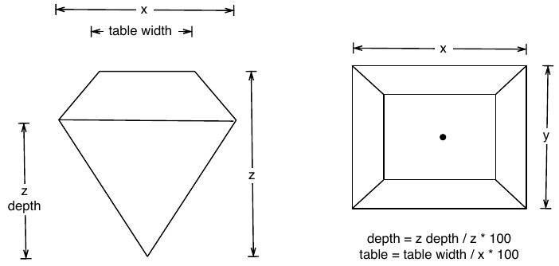

{height=250 fig-align="center"}


:::: {.pa4}
::: {.athelas .ml0 .mt0 .pl4 .black-90 .bl .bw2 .b--blue}
["The fear of death follows from the fear of life. A man who lives fully is prepared to die at any time."]{.f5 .f4-m .f3-l .lh-copy .measure .mt0}

[ --- Mark Twain]{.f6 .ttu .tracked .fs-normal}
:::
::::

##  Setting up R Packages

```{r}
#| label: setup
#| include: true
#| message: false
#| 

library(tidyverse) # Sine Qua Non package in R
library(mosaic) # Our Favourite Bag of Tricks
library(ggformula) # Graphing 
library(skimr) # Data Inspection and Summary
##
library(crosstable) # Fast stats for multiple variables in table form
library(tinytable) # Elegant Tables for our data
library(visdat) # Mapping missing data
library(naniar) # Missing data visualization and munging
library(janitor) # Clean the data
library(tinytable) # Printing Tables for our data
library(DT) # Interactive Tables for our data
library(ggrepel) # Repel overlapping text labels in ggplot2
library(marquee) # Annotations for ggplot2

```


```{r}
#| label: Extra-Pedagogical-Packages
#| echo: false
#| message: false

library(checkdown)
library(epoxy)
library(TeachHist)
library(TeachingDemos)
library(visualize) # Plot Densities, Histograms and Probabilities as areas under the curve
library(grateful)
library(MKdescr)
library(shinylive) # To create a Shiny app in a Quarto HTML doc
# Will not work if webr is also used in the SAME Quarto doc!

library(downloadthis)
#devtools::install_github("mccarthy-m-g/embedr")
library(embedr) # Embed multimedia in HTML files


```

#### Plot Fonts and Theme

```{r}
#| label: plot-theme-ggplot4
#| cache: false
#| code-fold: true
#| messages: false
#| warning: false
#| 
library(systemfonts)
library(showtext)
## Clean the slate
systemfonts::clear_local_fonts()
systemfonts::clear_registry()
##
showtext_opts(dpi = 96) #set DPI for showtext
sysfonts::font_add(family = "Alegreya",
  regular = "../../../../../../fonts/Alegreya-Regular.ttf",
  bold = "../../../../../../fonts/Alegreya-Bold.ttf",
  italic = "../../../../../../fonts/Alegreya-Italic.ttf",
  bolditalic = "../../../../../../fonts/Alegreya-BoldItalic.ttf")

sysfonts::font_add(family = "Roboto Condensed", 
  regular = "../../../../../../fonts/RobotoCondensed-Regular.ttf",
  bold = "../../../../../../fonts/RobotoCondensed-Bold.ttf",
  italic = "../../../../../../fonts/RobotoCondensed-Italic.ttf",
  bolditalic = "../../../../../../fonts/RobotoCondensed-BoldItalic.ttf")
showtext_auto(enable = TRUE) #enable showtext
##
theme_custom <- function(){ 

    theme_bw(base_size = 10) + 
    
    theme_sub_axis(title = element_text(family = "Roboto Condensed", 
                                       size = 8),
                   text = element_text(family = "Roboto Condensed", 
                                       size = 6)) + 
    
    theme_sub_legend(text = element_text(family = "Roboto Condensed", 
                                         size = 6),
                     title = element_text(family = "Alegreya", 
                                          size = 8)) + 
    
    theme_sub_plot(title = element_text(family = "Alegreya", 
                                        size = 14, face = "bold"),
                   title.position = "plot",
                   subtitle = element_text(family = "Alegreya", 
                                           size = 10),
                   caption = element_text(family = "Alegreya", 
                                          size = 6),
                   caption.position = "plot")
    
}

## Use available fonts in ggplot text geoms too!
ggplot2::update_geom_defaults(geom = "text", new = list(
  family = "Roboto Condensed",
  face = "plain",
  size = 3.5,
  color = "#2b2b2b"
)
)
ggplot2::update_geom_defaults(geom = "label", new = list(
  family = "Roboto Condensed",
  face = "plain",
  size = 3.5,
  color = "#2b2b2b"
)
)

ggplot2::update_geom_defaults(geom = "marquee", new = list(
  family = "Roboto Condensed",
  face = "plain",
  size = 3.5,
  color = "#2b2b2b"
)
)
ggplot2::update_geom_defaults(geom = "text_repel", new = list(
  family = "Roboto Condensed",
  face = "plain",
  size = 3.5,
  color = "#2b2b2b"
)
)
ggplot2::update_geom_defaults(geom = "label_repel", new = list(
  family = "Roboto Condensed",
  face = "plain",
  size = 3.5,
  color = "#2b2b2b"
)
)

## Set the theme
ggplot2::theme_set(new = theme_custom())

## tinytable options
options("tinytable_tt_digits" = 2)
options("tinytable_format_num_fmt" = "significant_cell")
options(tinytable_html_mathjax = TRUE)


## Set defaults for flextable
flextable::set_flextable_defaults(font.family = "Roboto Condensed")

```


##  What graphs will we see today?

| Variable #1 | Variable #2 | Chart Names |                    Chart Shape    | 
|:-------------:|:--------------:|:------------------:|:--------------------:|:------:|
|    Quant    |    None     |  Histogram | |


##  What kind of Data Variables will we choose?

::: {.column-page-inset-right}
```{r}
#| message: false
#| echo: false
#| warning: false
read_csv("../../../../../materials/Data/pronouns.csv") %>% 
  filter(No == "1") %>% 
  tt(theme = "striped") %>%  
  style_tt(color = "black",fontsize = 0.75, line = "tblr",
    line_width = 0.4,
    line_color = "white")
  
```
:::

##  Inspiration


::: {#fig-golf-drive-evolution layout-ncol=2}

{height=200}


{height=200}

Golf Drive Distance over the years
:::

### What does this Chart tell us?

What do we see here? In about two-and-a-half decades, golf drive distances have increased, *on the average*, by 35 yards. The maximum distance has also gone up by 30 yards, and the minimum is now at 250 yards, which was close to average in 1983! What was a decent average in 1983 is just the bare minimum in 2017!!

Is it the dimples that the golf balls have? But these have been around a long time...or is it the clubs, and the swing technique invented by more recent players? 

### Hans Rosling's famous Presentation

Now, let us listen to the late great Hans Rosling from the [Gapminder
Project](https://www.gapminder.org), which aims at telling stories of
the world with data, to remove systemic biases about poverty, income and
gender related issues.



##  How do Histograms Work?

**Histograms** are best to show the distribution of raw **Quantitative data**, by displaying the number of values that fall within defined
ranges, often called *buckets* or *bins*. We use a **Quant** variable on the `x-axis` and the histogram shows us how frequently different values
occur for that variable by showing *counts/frequencies* on the y-axis.
The x-axis is typically broken up into "buckets" or ranges for the
x-variable. And usually you can adjust the bucket ranges to explore
frequency patterns. For example, you can widen histogram buckets from
0-1, 1-2, 2-3, etc. to 0-2, 2-4, etc. 

Although **Bar Charts** may look similar to **Histograms**, the two are
different. **Bar Charts** show counts of observations with respect to a **Qualitative** variable. For instance, bar charts show *categorical data* with multiple *levels*, such as fruits, clothing, household products in an inventory. Each *bar* has a height proportional to the *count* per shirt-size, in this example. 

Histograms do not usually show spaces between buckets because the buckets represent contiguous ranges, while bar charts show spaces to separate each (unconnected) *category/level* within a Qual variable.

##  Case Study-1: `diamonds` dataset

::: {.panel-tabset .nav-pills style="background: whitesmoke; "}

### Read the Data
We will first look at at a dataset that is directly available in R, the
`diamonds` dataset. As always, we will use our munging process to clean up the data for analysis.

```{r}
#| label: load-diamonds
data("diamonds", package = "ggplot2")
glimpse(diamonds)

```

We have ~54000 observations, with 10 variables. There are no missing values in any variable. It is a nice mix of Quantitative and Qualitative variables. 

### Data Munging

Since the variables are nicely converted to factor where needed, and the names are already clean we will just use `janitor` to essentially rename our dataset.

```{r}
#| label: data-munging
#| code-fold: true
#| 
diamonds_modified <- diamonds %>%
  janitor::clean_names(case = "snake") %>% 
  janitor::remove_empty(which = c("rows", "cols")) # Empty columns and rows if any
diamonds_modified %>% glimpse()
```

:::


###  Examine the Data

As per our Workflow, we will look at the data using all the three
methods we have seen.

::: {.panel-tabset .nav-pills style="background: whitesmoke; "}

####  dplyr::glimpse

```{r}
#| label: glimpse-diamonds
glimpse(diamonds_modified)

```

####  skimr::skim

```{r}
#| label: skim-diamonds
skim(diamonds_modified)

```

####  mosaic::inspect

```{r}
#| label: inspect-diamonds
inspect(diamonds_modified)

```

####  web-r

```{webr-r}
#| label: glimpse-diamonds-webr
glimpse(diamonds_modified)

```

```{webr-r}
#| label: skim-diamonds-webr
skim(diamonds_modified)

```

```{webr-r}
#| label: inspect-diamonds-webr
inspect(diamonds_modified)

```

:::

###  Data Dictionary

:::: {.columns}
::: {.column}
{#fig-diamond-dimensions}
:::

::: {.column}

::: callout-note
### Quantitative Data

  - `carat`(dbl): weight of the diamond	0.2-5.01
  - `depth`(dbl): depth	total depth percentage	43-79
  - `table`(dbl): width of top of diamond relative to widest point	43-95
  - `price`(dbl): price in US dollars	$326-$18,823
  - `x`(dbl): length in mm	0-10.74
  - `y`(dbl): width in mm	0-58.9
  - `z`(dbl): depth in mm	0-31.8
:::
:::

::: {.column}
::: callout-note
### Qualitative Data
- `cut`<ord>: diamond cut	Fair, Good, Very Good, Premium, Ideal
- `color`<ord>: diamond color	J (worst) to D (best). (7 levels)
- `clarity`. measurement of how clear the diamond is	I1 (worst), SI2, SI1, VS2, VS1, VVS2, VVS1, IF (best).

These have 5, 7, and 8 levels respectively. The fact that the `class` for these is `ordered` suggests that these are factors and that the levels have a sequence/order.
:::
:::

::: {.column}

::: callout-note
### Business Insights on Examining the `diamonds` dataset

-   This is a large dataset (54K rows).
-   There are several Qualitative variables: 
-   `carat`, `price`, `x`, `y`, `z`, `depth` and `table` are
    Quantitative variables.
-   There are no missing values for any variable, all are complete with
    54K entries.
:::
:::
::::


###  Hypothesis and Research Questions

Let us formulate a few Questions about this dataset. At some point, we might develop a hunch or two, and these would become our hypotheses to investigate. This is an iterative process!

::: callout-note
#### Hypothesis and Research Questions
- The `target variable` for an experiment that resulted in this data might be the `price` variable. Which is a numerical Quant variable.\
- There are also `predictor variables` such as `carat` (Quant), `color`(Qual), `cut`(Qual), and `clarity`(Qual).\
- Other `predictor variables` might be `x, y, depth, table`(all Quant)\
- Research Questions:
  - What is the distribution of the target variable `price`?
  - What is the distribution of the predictor variable `carat`?
  - Does a `price` distribution vary based upon type of `cut`, `clarity`, and `color`?

These should do for now. Try and think of more Questions!
:::

###  Plotting Histograms

Let's plot some histograms to answer each of the Hypothesis questions above. 

###  Question-1: What is the distribution of the target variable `price`?

::: {.panel-tabset .nav-pills style="background: whitesmoke; "}

### ggformula-1
:::: {.columns}
::: {.column}
```{r}
#| label: histogram-price-ggformula-1
#| eval: false
ggplot2::theme_set(new = theme_custom())

gf_histogram(~ price, data = diamonds_modified) %>%
  gf_labs(title = "Plot 1A: Diamond Prices",
          caption = "ggformula")

```
:::
::: {.column}
```{r}
#| ref.label: histogram-price-ggformula-1
#| echo: false
```


:::
::::

:::: {.columns}
::: {.column}
```{r}
#| label: histogram-price-ggformula-2
#| eval: false
ggplot2::theme_set(new = theme_custom())

## More bins
gf_histogram(~ price, data = diamonds_modified, 
             bins = 100) %>%
  gf_labs(title = "Plot 1B: Diamond Prices",
          caption = "ggformula")

```
:::
::: {.column}
```{r}
#| ref.label: histogram-price-ggformula-2
#| echo: false
```
:::

::::

### ggplot-1

```{r}
#| label: histogram-price-ggplot
#| message: false
ggplot2::theme_set(new = theme_custom())

ggplot(data = diamonds_modified) + 
  geom_histogram(aes(x = price)) +
  labs(title = "Plot 1A: Diamond Prices",
       caption = "ggplot")
## More bins
ggplot(data = diamonds_modified) + 
  geom_histogram(aes(x = price), bins = 100) +
  labs(title = "Plot 1B: Diamond Prices",
       caption = "ggplot")

```

###  web-r-1

```{webr-r}

gf_histogram(~ price, data = diamonds_modified) %>%
  gf_labs(title = "Plot 1A: Diamond Prices",
          caption = "ggformula")
## More bins
gf_histogram(~ price, data = diamonds_modified, 
  bins = 100) %>%
  gf_labs(title = "Plot 1B: Diamond Prices",
          caption = "ggformula")

```


### Business Insights-1
- The `price` distribution is heavily skewed to the right.\
- There are a great many diamonds at relatively low prices, but there are a good few diamonds at very high prices too.\
- Using a high number of bins does not materially change the view of the histogram.\
:::

###  Question-2: What is the distribution of the predictor variable `carat`?

::: {.panel-tabset .nav-pills style="background: whitesmoke; "}

### ggformula-2
:::: {.columns}
::: {.column}
```{r}
#| label: histogram-carat-ggformula-1
#| eval: false
ggplot2::theme_set(new = theme_custom())

diamonds_modified %>% 
  gf_histogram(~ carat) %>%
  gf_labs(title = "Plot 2A: Carats of Diamonds",
          caption = "ggformula")
```
:::
::: {.column}
```{r}
#| ref.label: histogram-carat-ggformula-1
#| echo: false
```

:::
::::

:::: {.columns}
::: {.column}
```{r}
#| label: histogram-carat-ggformula-2
#| eval: false
ggplot2::theme_set(new = theme_custom())

## More bins
diamonds_modified %>% 
  gf_histogram(~ carat, 
  bins = 100) %>%
  gf_labs(title = "Plot 2B: Carats of Diamonds",
          caption = "ggformula")
```
:::
::: {.column}
```{r}
#| ref.label: histogram-carat-ggformula-2
#| echo: false
```

:::
::::

### ggplot-2
```{r}
#| layout-ncol: 2
#| message: false
ggplot2::theme_set(new = theme_custom())

diamonds_modified %>% 
  ggplot() + 
  geom_histogram(aes(x = carat)) + 
  labs(title = "Plot 2A: Carats of Diamonds",
          caption = "ggplot")
## More bins
diamonds_modified %>% 
  ggplot() + 
  geom_histogram(aes(x = carat), bins = 100) + 
  labs(title = "Plot 2A: Carats of Diamonds",
          caption = "ggplot")

```

###  web-r-2

```{webr-r}

diamonds_modified %>% 
  gf_histogram(~ carat) %>%
  gf_labs(title = "Plot 2A: Carats of Diamonds",
          caption = "ggformula")
## More bins
diamonds_modified %>% 
  gf_histogram(~ carat, bins = 100) %>%
  gf_labs(title = "Plot 2B: Carats of Diamonds",
          caption = "ggformula")
```

### Business Insights-2

- `carat` also has a heavily right-skewed distribution.\
- However, there is a marked "discreteness" to the distribution. Some values of carat are far more common than others. For example, 1, 1.5, and 2 carat diamonds are large in number.\
- Why does the X-axis extend up to 5 carats? There must be some, very few, diamonds of very high carat value!

:::


###  Question-3: Does a `price` distribution vary based upon type of `cut`, `clarity`, and `color`?

::: {.panel-tabset .nav-pills style="background: whitesmoke; "}

### ggformula-3
:::: {.columns}
::: {.column}
```{r}
#| label: ggformula-price-others-1
#| eval: false
ggplot2::theme_set(new = theme_custom())

gf_histogram(~ price, fill = ~ cut, data = diamonds_modified) %>%
  gf_labs(title = "Plot 3A: Diamond Prices",caption = "ggformula") 
```
:::
:::{.column}
```{r}
#| ref.label: ggformula-price-others-1
#| echo: false
```
:::
::::


:::: {.columns}
::: {.column}
```{r}
#| label: ggformula-price-others-2
#| eval: false
ggplot2::theme_set(new = theme_custom())

diamonds_modified %>% 
  gf_histogram(~ price, fill = ~ cut, color = "black", alpha = 0.3) %>%
  gf_labs(title = "Plot 3B: Prices by Cut",
          caption = "ggformula")
```
:::
:::{.column}
```{r}
#| ref.label: ggformula-price-others-2
#| echo: false
```
:::
::::

:::: {.columns}
::: {.column}
```{r}
#| label: ggformula-price-others-3
#| eval: false
ggplot2::theme_set(new = theme_custom())

diamonds_modified %>% 
  gf_histogram(~ price, fill = ~ cut, color = "black", alpha = 0.3) %>%
  gf_facet_wrap(~ cut) %>%
  gf_labs(title = "Plot 3C: Prices by Filled and Facetted by Cut",
          caption = "ggformula") %>%
  gf_theme(theme(
           axis.text.x = element_text(angle = 45, 
           hjust = 1)))
```
:::
:::{.column}
```{r}
#| ref.label: ggformula-price-others-3
#| echo: false
```
:::
::::

:::: {.columns}
::: {.column}
```{r}
#| label: ggformula-price-others-4
#| eval: false
ggplot2::theme_set(new = theme_custom())

diamonds_modified %>% 
  gf_histogram(~ price, fill = ~ cut, color = "black", alpha = 0.3) %>% 
  gf_facet_wrap(~ cut, scales = "free_y", nrow = 2) %>%
  gf_labs(title = "Plot 3D: Prices Filled and Facetted by Cut", 
          subtitle = "Free y-scale",
          caption = "ggformula") %>%
  gf_theme(theme(axis.text.x = 
           element_text(angle = 45, 
           hjust = 1)))
```
:::
:::{.column}
```{r}
#| ref.label: ggformula-price-others-4
#| echo: false
```
:::
::::

### ggplot-3
```{r}
#| layout-ncol: 2
ggplot2::theme_set(new = theme_custom())

diamonds_modified %>% ggplot() + 
  geom_histogram(aes(x = price, fill = cut), alpha = 0.3) + 
  labs(title = "Plot 3A: Prices by Cut", caption = "ggplot")
##
diamonds_modified %>% 
  ggplot() + 
  geom_histogram(aes(x = price, fill = cut), 
                 colour = "black", alpha = 0.3) + 
  labs(title = "Plot 3B: Prices filled by Cut", caption = "ggplot")
##
diamonds_modified  %>% ggplot() + 
  geom_histogram(aes(price, fill = cut),
                 colour = "black", alpha = 0.3) +
  facet_wrap(facets = vars(cut)) + 
  labs(title = "Plot 3C: Prices by Filled and Facetted by Cut",
       caption = "ggplot") + 
  theme(axis.text.x = element_text(angle = 45, hjust = 1))
##
diamonds_modified  %>% ggplot() + 
  geom_histogram(aes(price, fill = cut), 
                 colour = "black", alpha = 0.3) +
  facet_wrap(facets = vars(cut), scales = "free_y") +
  labs(title = "Plot D: Prices by Filled and Facetted by Cut",
       subtitle = "Free y-scale",
       caption = "ggplot") + 
  theme(axis.text.x = element_text(angle = 45, hjust = 1))

```

###  web-r-3

```{webr-r}

gf_histogram(~ price, fill = ~ cut, data = diamonds_modified) %>%
  gf_labs(title = "Plot 3A: Diamond Prices",caption = "ggformula") 
###
diamonds_modified %>% 
  gf_histogram(~ price, fill = ~ cut, color = "black", alpha = 0.3) %>%
  gf_labs(title = "Plot 3B: Prices by Cut",
          caption = "ggformula")
###
diamonds_modified %>% 
  gf_histogram(~ price, fill = ~ cut, color = "black", alpha = 0.3) %>%
  gf_facet_wrap(~ cut) %>%
  gf_labs(title = "Plot 3C: Prices by Filled and Facetted by Cut",
          caption = "ggformula") %>%
  gf_theme(theme(axis.text.x = element_text(angle = 45, hjust = 1)))
###
diamonds_modified %>% 
  gf_histogram(~ price, fill = ~ cut, color = "black", alpha = 0.3) %>% 
  gf_facet_wrap(~ cut, scales = "free_y", nrow = 2) %>%
  gf_labs(title = "Plot 3D: Prices Filled and Facetted by Cut", 
          subtitle = "Free y-scale",
          caption = "ggformula") %>%
  gf_theme(theme(axis.text.x = element_text(angle = 45, hjust = 1)))

```

### Business Insights-3

-   The price distribution is heavily skewed to the right AND This
`long-tailed` nature of the histogram holds true **regardless** of the `cut` of the diamond.
-   See the x-axis range for each plot in Plot D! Price ranges are the
    same regardless of cut !! Very surprising! So `cut` is perhaps not
    the only thing that determines price...
-   Facetting the plot into *small multiples* helps look at patterns
    better: overlapping histograms are hard to decipher. Adding `color`
    defines the bars in the histogram very well.
:::


### A Hypothesis

- The surprise insight above should lead you to make a Hypothesis! 
- You should decide whether you want to investigate this question further, making more graphs, as we will see. Here, we are making a **Hypothesis** that more than just `cut` determines the `price` of a diamond.


### An Interactive App for Histograms

Type in your Console:

```{r}
#| eval: false
#| echo: fenced
install.packages("shiny")
library(shiny)
runExample("01_hello")      # an interactive histogram

```

::: {.content-visible when-format="html" unless-format="revealjs"}
##  Case Study-2: `race` dataset

###  Import data

These data come from the
[TidyTuesday](https://github.com/rfordatascience/tidytuesday), project,
a weekly social learning project dedicated to gaining practical
experience with R and data science. In this case the TidyTuesday data
are based on [International Trail Running Association
(ITRA)](https://itra.run/Races/FindRaceResults) data but inspired by
Benjamin Nowak. We will use the [TidyTuesday data that are on
GitHub](https://github.com/rfordatascience/tidytuesday/tree/master/data/2021/2021-10-26).
Nowak's data are [also available on
GitHub](https://github.com/BjnNowak/UltraTrailRunning).

::: {.panel-tabset .nav-pills style="background: whitesmoke; "}

###  R
```{r}
#| message: false
#| warning: false
race_df <- read_csv("https://raw.githubusercontent.com/rfordatascience/tidytuesday/master/data/2021/2021-10-26/race.csv")
rank_df <- read_csv("https://raw.githubusercontent.com/rfordatascience/tidytuesday/master/data/2021/2021-10-26/ultra_rankings.csv")

```

The data has automatically been read into the `webr` session, so you can continue on to the next code chunk! And the names are already cleaned up, so we can use them directly.

```{webr-r}
#| context: setup
# Read the data
race_df <- read.csv("https://raw.githubusercontent.com/rfordatascience/tidytuesday/master/data/2021/2021-10-26/race.csv")
rank_df <- read.csv("https://raw.githubusercontent.com/rfordatascience/tidytuesday/master/data/2021/2021-10-26/ultra_rankings.csv")

```
:::


###  Examine the race Data

Let us look at the dataset using all our three methods:

::: {.panel-tabset .nav-pills style="background: whitesmoke; "}


####  dplyr
```{r}
#| label: glimpse-race-data
glimpse(race_df)
glimpse(rank_df)

```

####  skimr
```{r}
#| label: skimr-race-data-1
skim(race_df)

```

```{r}
#| label: skimr-race-data-2
skim(rank_df)

```


####  mosaic

```{r}
#| label: inspect-race
#| include: false
# inspect(race_df) # does not work with hms and difftime variables
inspect(rank_df)

```

We can also try our new friend `mosaic::favstats`:
```{r}
#| label: race-favstats
race_df %>% 
  favstats(~ distance, data = .)
##
race_df %>% 
  favstats(~ participants, data = .)
##
rank_df %>% 
  drop_na() %>% 
  favstats(time_in_seconds ~ gender, data = .)

```


####  crosstable
::: callout-note
### Introducing `crosstable`
`mosaic::favstats` allows to summarise just **one variable at a time**. On occasion we may need to see summaries of several Quant variables, over levels of Qual variables. This is where the package `{{crosstable}}` is so effective: note how `{{crosstable}}` also conveniently uses the **formula interface** that we are getting accustomed to. 

We will find occasion to meet `{{crosstable}}` again when we do [Inference. ](../../../20-Inference/listing.qmd)
:::

```{r}
#| label: race-crosstable
## library(crosstable)
crosstable(time_in_seconds + age~ gender, data = rank_df, num_digits = 3) %>% 
  crosstable::as_flextable()
```

(The `as_flextable` command from the `{{crosstable}}` package helped to render this elegant HTML table we see. It should be possible to do Word/PDF also, which we might see later.)

Hmm...women's `time_in_seconds` are less than those for men by 6000 seconds??? How come? Are the races different for men and women??


####  web-r

```{webr-r}
#| label: glimpse-race-data-webr-1
glimpse(race_df)
glimpse(rank_df)

```

```{webr-r}
#| label: glimpse-race-data-webr-2
skim(race_df)
```

```{webr-r}
#| label: glimpse-race-data-webr-3
skim(rank_df)
```

```{webr-r}
#| label: inspect-race-webr
# inspect(race_df) # does not work with hms and difftime variables
inspect(rank_df)

```


:::

###  Data Dictionary

::: callout-note
#### Quantitative Data
From `race_df`, we have the following Quantitative variables:

- `race_year_id`: A number uniquely identifying the race event
- `distance`: Race Distance (miles?)
- `elevation_gain`: Gain in Elevation along the route (feet?)
- `elevation_loss`: Loss in Elevation along the route (feet?)
- `particants`: No. of participants
- `aid_stations`: No. of aid stations along the race route. 

And from `rank_df` we have the following Quantitative variables:

- `rank`: Placement Rank of the Athlete
- `time`: Race completion time ( h:m:s)
- `time_in_seconds`: Race Completion Time in seconds
- `age`: Age of the athlete in years;


:::

::: callout-note
#### Qualitative Data
- `country`: Country of the Race
- `city`: Location
- `gender`: Of the Athlete
- `participation`: Solo / solo, relay, team. Badly coded?. 

:::


::: callout-note

### Business Insights from `race` data

-   We have two datasets, one for races (`race_df`) and one for the
    ranking of athletes (`rank_df`).
-   There is atleast one common column between the two, the
    `race_year_id` variable.
-   Overall, there are *Qualitative* variables such as `country`,
    `city`,`gender`, and `participation`. This last variables seems
    badly coded, with entries showing `solo` and `Solo`.
-   *Quantitative variables* are `rank`, `time`,`time_in_seconds`, `age`
    from `rank_df`; and `distance`, `elevation_gain`,
    `elevation_loss`,`particants`, and `aid_stations` from `race_df`.
-   We have 1207 races and over 130K participants! But some races do
    show *zero* participants!! Is that an error in data entry?
:::


###  EDA with `race` datasets

Since this dataset is somewhat complex, we may for now just have a detailed set of Questions, that helps us get better acquainted with it. On the way, we may get surprised by some finding then want to go deeper, with a hunch or hypothesis.

###  Question-1: Max. Races and participants

::: callout-note

### Question #1
Which countries host the maximum number of races? Which
countries send the maximum number of participants??

::: {.panel-tabset .nav-pills style="background: whitesmoke; "}

###  R

```{r}
race_df %>% count(country) %>% arrange(desc(n)) %>% top_n(3, n)
rank_df %>% count(nationality) %>% arrange(desc(n)) %>% top_n(6, n)

```

###  web-r

```{webr-r}
race_df %>% count(country) %>% arrange(desc(n)) %>% top_n(3, n)
rank_df %>% count(nationality) %>% arrange(desc(n)) %>% top_n(6, n)

```

:::

The top three locations for races were the USA, UK, and France. These
are also the countries that send the maximum number of participants,
naturally!
:::

###  Question-2: Max. Winners

::: callout-note
### Question #2
Which countries have the maximum number of winners (top 3
ranks)?

::: {.panel-tabset .nav-pills style="background: whitesmoke; "}

###  R

```{r}
rank_df %>% 
  filter(rank %in% c(1,2,3)) %>%
  count(nationality) %>% arrange(desc(n)) %>% top_n(6, n)

```

###  web-r

```{webr-r}
rank_df %>% 
  filter(rank %in% c(1,2,3)) %>%
  count(nationality) %>% arrange(desc(n)) %>% top_n(6, n)

```

:::

1240 Participants from the USA have been top 3 finishers. Across *all*
races...

:::

###  Question-3: Which countries have had the most top-3 finishes?

::: callout-note
### Question #3
Which countries have had the most top-3 finishes in the
**longest** distance race?

Here we see we have ranks in one dataset, and race details in another!
How do we do this now? We have to **join** the two data frames into one
data frame, using a *common variable* that uniquely identifies
observations in **both** datasets.

::: {.panel-tabset .nav-pills style="background: whitesmoke; "}

###  R

```{r}
#| layout-nrow: 2

longest_races <- race_df %>%
  slice_max(n = 5, order_by = distance) %>%  # Longest distance races
  select (race_year_id, country, distance) # Select only relevant columns)
longest_races

### Now join this with the `rank_df` dataset
longest_races %>%
  left_join(., rank_df, by  = "race_year_id") %>% # total participants in longest 4 races
  filter(rank %in% c(1:10)) %>% # Top 10 ranks
  count(nationality) %>% arrange(desc(n))

```

###  web-r

```{webr-r}

longest_races <- race_df %>%
  slice_max(n = 5, order_by = distance) # Longest distance races
longest_races

```

```{webr-r}

longest_races %>%
  left_join(., rank_df, by  = "race_year_id") %>% # total participants in longest 4 races
  filter(rank %in% c(1:10)) %>% # Top 10 ranks
  count(nationality) %>% arrange(desc(n))

```

:::


Wow....France has one the top 10 positions 26 times in the longest
races... which take place in France, Thailand, Chad, Australia, and
Portugal. So although the USA has the greatest number of top 10
finishes, when it comes to the *longest* races, it is `r emoji::emoji("france")` *vive la France*!

:::

###  Question-4: What is the distribution of the finishing times?

::: callout-note
### Question #4
What is the distribution of the finishing times, across all
races and all ranks across gender of the particants?

::: {.panel-tabset .nav-pills style="background: whitesmoke; "}

###  R
:::: {.columns}
::: {.column}
```{r}
#| label: ggformula-race-times-1
#| eval: false
ggplot2::theme_set(new = theme_custom())

rank_df %>% drop_na(gender) %>% 
  gf_dhistogram(~ time_in_seconds, fill = ~ gender, bins = 175) %>%
  gf_labs(title = "Histogram of Race Times")

```
:::
::: {.column}
```{r}
#| ref.label: ggformula-race-times-1
#| echo: false
```

:::
::::

###  web-r

```{webr-r}

rank_df %>%
  gf_histogram(~ time_in_seconds, bins = 75)  %>%
  gf_labs(title = "Histogram of Race Times")

```
:::

So the distribution is (very) roughly bell-shaped, spread over a 2X
range. And some people may have dropped out of the race very early and
hence we have a small bump close to *zero* time! The histogram shows
three bumps...at least one reason is that the distances to be covered
are not the same...but could there be other reasons? Like
`altitude_gained` for example?

We should really try to plot the X-axis with a better-formatted time axis. MAybe with transformations too!! That is for later!!
:::

###  Question-5: What is the distribution of race distances?

::: callout-note
### Question #5
What is the distribution of race distances?

::: {.panel-tabset .nav-pills style="background: whitesmoke; "}

###  R
:::: {.columns}
::: {.column}
```{r}
#| label: ggformula-race-times-2
#| eval: false
ggplot2::theme_set(new = theme_custom())

race_df %>%
  gf_histogram(~ distance, bins =  50) %>%
  gf_labs(title = "Histogram of Race Distances")

```
:::
::: {.column}
```{r}
#| label: ggformula-race-times-2
#| echo: false
```

:::
::::
Hmm...a closely clumped set of race distances, with some entries in
between \[0-150\], but some are zero? Which are these?

```{r}
race_df %>%
  filter(distance == 0)
```

###  web-r

```{webr-r}

race_df %>%
  gf_histogram(~ distance, bins =  50) %>%
  gf_labs(title = "Histogram of Race Distances")

```

Hmm...a closely clumped set of race distances, with some entries in
between \[0-150\], but some are zero? Which are these?

```{webr-r}

race_df %>%
  filter(distance == 0)

```
:::

Curious...some of these zero-distance races have had participants too!
Perhaps these were cancelled events...all of them are stated to be
`100 mile` events...

:::


###  Question-6: What is the distribution of finishing times for race distance around 150?
::: callout-note
### Question #6
For all races that have a distance around 150, what is the
distribution of finishing times? Can these be split/facetted using
`start_time` of the race (i.e. morning / evening) ?

::: {.panel-tabset .nav-pills style="background: whitesmoke; "}

###  R

Let's make a count of start times:

```{r}

race_times <- race_df %>%
  count(start_time) %>% arrange(desc(n))
race_times

```

Let's convert `start_time` into a `factor` with levels:
early_morning(0200:0600), late_morning(0600:1000), midday(1000:1400),
afternoon(1400: 1800), evening(1800:2200), and night(2200:0200)

```{r}
#| label: Slicing_time_to_Qual
#| code-fold: true
# Demo purposes only!
ggplot2::theme_set(new = theme_custom())

race_start_factor <- race_df %>%
  filter(distance == 0) %>%  # Races that actually took place
  mutate(
    start_day_time =
      case_when(
        start_time > hms("02:00:00") &
          start_time <= hms("06:00:00") ~ "early_morning",
        
        start_time > hms("06:00:01") &
          start_time <= hms("10:00:00") ~ "late_morning",
        
        start_time > hms("10:00:01") &
          start_time <= hms("14:00:00") ~ "mid_day",
        
        start_time > hms("14:00:01") &
          start_time <= hms("18:00:00") ~ "afternoon",
        
        start_time > hms("18:00:01") &
          start_time <= hms("22:00:00") ~ "evening",
        
        start_time > hms("22:00:01") &
          start_time <= hms("23:59:59") ~ "night",
        
        start_time >= hms("00:00:00") &
          start_time <= hms("02:00:00") ~ "postmidnight",
        
        .default =  "other"
      )
  ) %>%
  mutate(start_day_time = 
           as_factor(start_day_time) %>%
           fct_collapse(.f = ., 
               night = c("night", "postmidnight")))
##
# Join with rank_df
race_start_factor %>%
  left_join(rank_df, by = "race_year_id") %>%
  drop_na(time_in_seconds) %>%
  gf_histogram(
    ~ time_in_seconds,
    bins = 75,
    fill = ~ start_day_time,
    color = ~ start_day_time,
    alpha = 0.5
  ) %>%
  gf_facet_wrap(vars(start_day_time), ncol = 2, scales = "free_y") %>%
  gf_labs(title = "Race Times by Start-Time")

```

###  web-r

Let's make a count of start times:

```{webr-r}

race_times <- race_df %>%
  count(start_time) %>% arrange(desc(n))
race_times

```

Let's convert `start_time` into a `factor` with levels:
early_morning(0200:0600), late_morning(0600:1000), midday(1000:1400),
afternoon(1400: 1800), evening(1800:2200), and night(2200:0200)

```{webr-r}
#| label: Slicing_time_to_Qual
# Demo purposes only!

race_start_factor <- race_df %>%
  filter(distance == 0) %>%  # Races that actually took place
  mutate(
    start_day_time =
      case_when(
        start_time > hms("02:00:00") &
          start_time <= hms("06:00:00") ~ "early_morning",
        
        start_time > hms("06:00:01") &
          start_time <= hms("10:00:00") ~ "late_morning",
        
        start_time > hms("10:00:01") &
          start_time <= hms("14:00:00") ~ "mid_day",
        
        start_time > hms("14:00:01") &
          start_time <= hms("18:00:00") ~ "afternoon",
        
        start_time > hms("18:00:01") &
          start_time <= hms("22:00:00") ~ "evening",
        
        start_time > hms("22:00:01") &
          start_time <= hms("23:59:59") ~ "night",
        
        start_time >= hms("00:00:00") &
          start_time <= hms("02:00:00") ~ "postmidnight",
        
        .default =  "other"
      )
  ) %>%
  mutate(start_day_time = 
           as_factor(start_day_time) %>%
           fct_collapse(.f = ., 
               night = c("night", "postmidnight")))
```


```{webr-r}

# Join with rank_df
race_start_factor %>%
  left_join(rank_df, by = "race_year_id") %>%
  drop_na(time_in_seconds) %>%
  gf_histogram(
    ~ time_in_seconds,
    bins = 75,
    fill = ~ start_day_time,
    color = ~ start_day_time,
    alpha = 0.5
  ) %>%
  gf_facet_wrap(vars(start_day_time), ncol = 2, scales = "free_y") %>%
  gf_labs(title = "Race Times by Start-Time")
  
```


:::


We see that finish times tend to be longer for afternoon and evening
start races; these are lower for early morning and night time starts.
Mid-day starts show a curious double hump in finish times that should be
studied.
:::

:::


##  Distributions and Densities in the Wild

:::: {.columns}

::: {.column width="50%"}
Before we conclude, let us look at a real world dataset: populations of
countries. This dataset was taken from Kaggle
<https://www.kaggle.com/datasets/ulrikthygepedersen/populations>. Click
on the icon below to save the file into a *subfolder* called `data` in
your project folder.
:::

:::{.column width="50%"}


:::

::::

```{r}
#| code-fold: true
#| layout-nrow: 2
pop <- read_csv("data/populations.csv")
pop
glimpse(pop)

```


### Real World Histograms
The `value` variable in this dataset is the population of a country.
Let us plot densities/histograms for `value`:

```{r}
#| label: fig-skewed-histogram
#| layout-ncol: 2
#| code-fold: true
ggplot2::theme_set(new = theme_custom())

gf_histogram(~ value, data = pop, title = "Long Tailed Histogram") 
gf_density(~ value, data = pop, title = "Long Tailed Density") 

```

These graphs convey very little to us: the data is very heavily skewed
to the right and much of the chart is empty. There are many countries
with small populations and a few countries with very large populations.
Such distributions are also called **"long tailed"** distributions. 

### Transforming the Variable

To develop better insights with this data, we should transform the variable concerned, using say a "log" transformation:

```{r}
#| code-fold: true
#| label: fig-skewed-density-with-transformation
#| layout-ncol: 2

ggplot2::theme_set(new = theme_custom())

gf_histogram(~ log10(value), data = pop, title = "Histogram with Log transformed x-variable") 
gf_density(~ log10(value), data = pop, title = "Density with Log transformed x-variable")

```

Be prepared to transform your data with `log` or `sqrt` transformations
when you see skewed distributions! 

###   Pareto, Power Laws, and Fat-Tailed Distributions

City Populations, Sales across product categories, Salaries, Instagram connections, number of customers vs Companies, net worth / valuation of Companies, extreme events on stock markets....all of these could have highly skewed distributions. In such a case, the standard statistics of mean/median/sd may not convey too much information. With such distributions, one additional observation on say net worth, like say Mr Gates', will change these measures completely. (More when we discuss [Sampling](../../../20-Inference/Modules/20-SampProb/index.qmd))

Since very large observations are indeed possible, if not highly probable, [one needs to look at the *result* of such an observation and its impact on a situation]{.black .bg-light-red} rather than [its (mere) probability]{.black .bg-light-green}. Classical statistical measures and analysis cannot apply with long-tailed distributions. More on this later in the Module on Statistical Inference, but for now, here is a video that talks in detail about *fat-tailed distributions*, and how one should use them and get used to them:

###   Pareto, Power Laws, and Fat-Tailed Distributions



###  Types of Distribution Shapes

:::: {.columns}
::: {.column}
```{r}
#| label: fig-Type-of-Distributions
#| code-fold: true
#| warning: false
#| message: false
#| fig-cap: Type of Distributions
#| out-height: 40%
#| out-width: 80%

#options(ragg.max_dim = 7000) # to avoid error in ragg device

# Build dataset with different distributions
library(hrbrthemes)

data <- data.frame(
  type = c( rep("edge peak", 1000), rep("comb", 1000), rep("normal", 1000), rep("uniform", 1000), rep("bimodal", 1000), rep("skewed", 1000) ),
  value = c( rnorm(900), rep(3, 100), rnorm(360, sd=0.5), rep(c(-1,-0.75,-0.5,-0.25,0,0.25,0.5,0.75), 80), rnorm(1000), runif(1000), rnorm(500, mean=-2), rnorm(500, mean=2), abs(log(rnorm(1000))) )
)

# Represent it
data %>%
  ggplot( aes(x=value)) +
    geom_histogram(fill="#69b3a2", color="#e9ecef", alpha=0.9) +
    facet_wrap(~type, scale="free_x") +
    theme_ipsum() +
    theme(
      panel.spacing = unit(0.1, "lines"),
      axis.title.x=element_blank(),
      axis.text.x=element_blank(),
      axis.ticks.x=element_blank()
    )
```

What insights could you develop based on these distribution shapes?\

- *Bimodal*: Maybe two different systems or phenomena or regimes under which the data unfolds. Like the geyser dataset (`r data(faithful, package = "datasets") `. Or a machine that works differently when cold and when hot. Intermittent faulty behaviour...\


:::

::: {.column}
- *Comb*: Some specific Observations occur predominantly, in an otherwise even spread or observations. In a survey many respondents round off numbers to nearest 100 or 1000. Check the distribution of the diamonds dataset for `carat` values which are suspiciously integer numbers in too many cases.\
- *Edge Peak*: Could even be a data entry artifact!! All unknown / unrecorded observations are recorded as $999$ !!`r emoji::emoji("scream_cat")`\
- *Normal*: Just what it says! Course Marks in a Univ cohort...\
- *Skewed*: Income, or friends count in a set of people. Do UI/UX peasants have more followers on Insta than say CAP people?\
- *Uniform*: The World is ~~not~~ flat. Anything can happen within a range. But not much happens outside! Sharp limits...
:::
::::

##  Z-scores

Look at the 4 graphs below:

::: {#fig-z-scores-and-probabilities}
```{r}
#| label: fig-z-scores-and-probabilities
#| results: hold
#| code-fold: true
#| layout-nrow: 2
#| layout-ncol: 2
#| out-height: 40%
#| out-width: 70%

TeachHistDens(Mean = 60, Sd = 5, VLine1 = 70, AxisFontSize = 14)

TeachHistDens(Mean = 60, Sd = 15, VLine1 = 70, AxisFontSize = 14)

xpnorm(mean = 60, sd = 5, q = 70, return = "plot", alpha = 0.5,
      method = "gg") %>% 
  gf_vline(xintercept = 60, colour = "red", linewidth = 1) %>%
  gf_annotate("label", x = 75, y = 0.05, label = "area = probability = 0.02275") %>%
  gf_annotate("curve", x = 76, y = 0.045, xend = 72.5, yend = 0.005,
              curvature = -0.3, arrow = arrow(length = unit(0.2, "cm"))) %>%
  gf_labs(title = "Z-score = 2", subtitle = "mean = 60, sd = 5") %>% 
  gf_refine(scale_x_continuous(limits = c(35, 85), breaks = seq(35, 85, by = 5)), scale_y_continuous(expand = c(0,0)))

xpnorm(mean = 60, sd = 15, q = 70, return = "plot", alpha = 0.5,
      method = "gg") %>% 
  gf_vline(xintercept = 60, colour = "red", linewidth = 1) %>%
  gf_annotate("label", x = 100, y = 0.02, label = "area = probability = 0.2525") %>%
  gf_annotate("curve", x = 100, y = 0.018, xend = 75, yend = 0.005,
              curvature = -0.3, arrow = arrow(length = unit(0.2, "cm"))) %>%
  gf_labs(title = "Z-score = 0.6667", subtitle = "mean = 60, sd = 15") %>% 
  gf_refine(scale_x_continuous(limits = c(-15, 135), 
breaks = seq(-15, 135, by = 15)), scale_y_continuous(expand = c(0,0)))


```
Z-scores and Probabilities
:::

```{r}
#| eval: false
#| include: false

TeachHistDens(Mean = 60, Sd = 5, VLine1 = 70, AxisFontSize = 14) %>% 
xpnorm(mean = 60, sd = 5, q = 70, return = "plot", alpha = 0.3,
      method = "gg", verbose = F) %>% 
  gf_vline(xintercept = 60, colour = "red") %>%
  gf_annotate("label", x = 75, y = 0.05, label = "area = probability = 0.02275") %>%
  gf_annotate("curve", x = 76, y = 0.045, xend = 72.5, yend = 0.005,
              curvature = -0.3, arrow = arrow(length = unit(0.2, "cm"))) %>%
  gf_labs(title = "Z-score = 2", subtitle = "mean = 60, sd = 5") %>% 
  gf_refine(scale_x_continuous(limits = c(35, 85), breaks = seq(35, 85, by = 5), expand = c(0,0))) 

```

### Understanding Z-scores

:::: {.columns}
::: {.column width="45%"}

Often when we compute wish to compare distributions with different
values for means and standard deviations, we resort to a *scaling* of
the variables that are plotted in the respective distributions.

Although the densities all look the same, they are are quite different!
The x-axis in each case has *two scales*: one is the actual value of the x-variable, and the other is the *z-score* which is calculated as the **scaled residual from the mean**:

$$
z_x = \frac{x - \mu_{x}}{\sigma_x}
$${#eq-zcores}

where $\mu_x$ and $\sigma_x$ are the mean and standard deviation of the x-variable.

::: callout-important
The `z-score` is [**the distance from the `mean`** (i.e. residual) scaled by the `sd`]{style="background-color:yellow;"}. 
:::
:::


::: {.column width="10%"}
:::

::: {.column width="45%"}
In the figures above, the ***absolute values*** of the random variables $x_i$ is always $10$ from the (identical) means $\mu_i$. However since the $\sigma_i$ are different, the `z-score` is different in each case. In the left column, the `z-score` is $2$; in the right column it is $0.6667$.

We note that the variation in density is the **same** at the same values of `z-score`. 

When we make comparisons of two random variables, our comparisons are done most easily when we compare `z-scores` to calculate probabilities, or differences in `z-scores` at identical probabilities.
:::
::::

##  Wait, But Why?

- Histograms are used to study the distribution of one or a few **Quant** variables.\
- Checking the distribution of your variables one by one is probably the first task you should do when you get a new dataset.\
- It delivers a good quantity of information about spread, how frequent the observations are, and if there are some outlandish ones.\
- Comparing histograms side-by-side helps to provide insight about whether a Quant measurement varies with situation (a Qual variable). We will see this properly in [a statistical way](../../../20-Inference/Modules/110-TwoMeans/index.qmd) soon.


##  Conclusion

To complicate matters: Having said all that, the histogram is really a bar chart in disguise! You probably suspect that *the "bucketing" of the Quant variable is tantamount to creating a Qual variable*! Each bucket is a *level* in this fictitious bucketed *Quant* variable. 

-   Histograms, Frequency Distributions, and Box Plots are used for
    Quantitative data variables\
-   Histograms "dwell upon" **counts**, **ranges**, **means** and
    **standard deviations**
-   We can split histograms on the basis of another Qualitative
    variable.
-   Long tailed distributions need care in visualization and in
    inference making!

##  Your Turn

:::: {.columns}

::: {.column width="50%"}
1. Old Faithful Data in R (Find it!)
2. Wage and Education Data from Canada
3. Time taken to Open or Close Packages

Some Design Students/HCD peasants tested Elderly people, some with and some without hand pain, and observed how long they took to open or close typical packages for milk, cheese, bottles etc. 
:::

::: {.column width="50%"}







:::
::::

::: callout-tip
Note: reading `xlsx` files into R may need the the `{{readxl}}` package. Install it!!
:::


##  AI Generated Summary and Podcast

The author illustrates these concepts through real-world examples using datasets such as diamond prices, ultramarathon race times, and global population figures. By analyzing these datasets with histograms, the author explores various aspects of data distributions, including skewness, bimodality, and the presence of outliers. The guide also introduces additional tools like the `{{crosstable}}` package and `z-scores` to enhance data analysis. Finally, the author encourages readers to apply these concepts to real-world datasets, developing questions and insights through the use of histograms and statistical measures.

- What patterns emerge from the distributions of quantitative variables in each dataset, and what insights can we gain about the relationships between these variables?

- How do different qualitative variables impact the distribution of quantitative variables in the datasets, and what are the implications of these findings for understanding the underlying phenomena?

- Based on the distributions and relationships between variables, what are the most relevant questions to ask about the datasets, and what further analyses could be conducted 


<center>
```{r}
#| echo: false
embedr::embed_audio("../../../../../materials/audio/Quantities.wav")
``` 
</center>


##  References

1. Winston Chang (2024). *R Graphics Cookbook*. <https://r-graphics.org>
1. See the scrolly animation for a histogram at this website: *Exploring Histograms, an essay by Aran Lunzer and Amelia McNamara*
<https://tinlizzie.org/histograms/?s=09>\
1. Minimal R using
`mosaic`.<https://cran.r-project.org/web/packages/mosaic/vignettes/MinimalRgg.pdf>\
1. Sebastian Sauer, *Plotting multiple plots using purrr::map and ggplot* [](https://data-se.netlify.app/2021/02/06/plotting-multiple-plots-using-purrr-map-and-ggplot/)\


::: {#refs style="font-size: 60%;"}
######  R Package Citations

```{r}
#| echo: false
#scan_packages()
cite_packages(
  output = "table",
  out.dir = ".",
  out.format = "html",
  pkgs = c("crosstable","ggridges", "NHANES", "TeachHist",
           "TeachingDemos", "visualize", "janitor", "visdat", "naniar", "tinytable")
) %>%
  knitr::kable(format = "simple")

```
