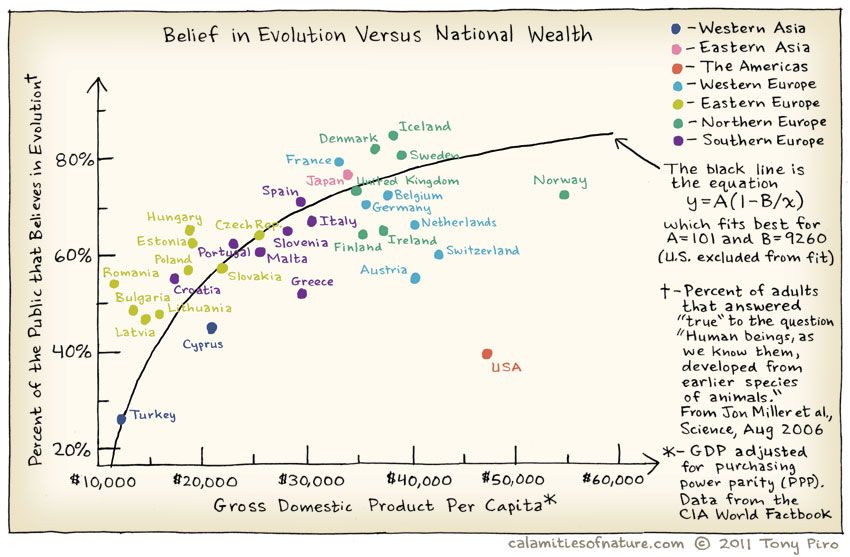

:::: {.pa4}
::: {.athelas .ml0 .mt0 .pl4 .black-90 .bl .bw2 .b--blue}
["The world says: 'You have needs -- satisfy them. You have as much right as the rich and the mighty. Don't hesitate to satisfy your needs; indeed, expand your needs and demand more.' This is the worldly doctrine of today. And they believe that this is freedom. The result for the rich is isolation and suicide, for the poor, envy and murder."]{.f5 .f4-m .f3-l .lh-copy .measure .mt0}

[ --- Fyodor Dostoevsky]{.f6 .ttu .tracked .fs-normal}
:::
::::

##  Setting up R Packages

```{r}
#| label: setup
#| message: false
#| warning: false
#| include: true

library(tidyverse) # Tidy data processing and plotting
library(ggformula) # Formula based plots
library(mosaic) # Our go-to package
library(skimr) # Another Data inspection package

library(GGally) # Corr plots
library(broom) # Clean reports from Stats / ML outputs

# library(devtools)
# devtools::install_github("rpruim/Lock5withR")
library(Lock5withR) # Datasets

library(easystats) # Easy Statistical Analysis and Charts
library(correlation) # Different Types of Correlations

library(janitor) # Data cleaning and tidying package
library(visdat) # Visualize whole dataframes for missing data
library(naniar) # Clean missing data
library(DT) # Interactive Tables for our data
library(tinytable) # Elegant Tables for our data
library(ggrepel) # Repelled Text Labels in ggplot
library(marquee) # Marquee Text Labels in ggplot

```

```{r}
#| label: Extra-Pedagogical-Packages
#| echo: false
#| message: false

library(checkdown)
library(epoxy)
library(TeachHist)
library(TeachingDemos)
library(visualize) # Plot Densities, Histograms and Probabilities as areas under the curve
library(grateful)
library(MKdescr)
library(downloadthis)
library(latex2exp)
#devtools::install_github("mccarthy-m-g/embedr")
library(embedr) # Embed multimedia in HTML files


```

#### Plot Fonts and Theme

```{r}
#| label: plot-theme-ggplot4
#| cache: false
#| code-fold: true
#| messages: false
#| warning: false
#| 
library(systemfonts)
library(showtext)
## Clean the slate
systemfonts::clear_local_fonts()
systemfonts::clear_registry()
##
showtext_opts(dpi = 96) #set DPI for showtext
sysfonts::font_add(family = "Alegreya",
  regular = "../../../../../../fonts/Alegreya-Regular.ttf",
  bold = "../../../../../../fonts/Alegreya-Bold.ttf",
  italic = "../../../../../../fonts/Alegreya-Italic.ttf",
  bolditalic = "../../../../../../fonts/Alegreya-BoldItalic.ttf")

sysfonts::font_add(family = "Roboto Condensed", 
  regular = "../../../../../../fonts/RobotoCondensed-Regular.ttf",
  bold = "../../../../../../fonts/RobotoCondensed-Bold.ttf",
  italic = "../../../../../../fonts/RobotoCondensed-Italic.ttf",
  bolditalic = "../../../../../../fonts/RobotoCondensed-BoldItalic.ttf")
showtext_auto(enable = TRUE) #enable showtext
##
theme_custom <- function(){ 

    theme_bw(base_size = 10) + 
    
    # theme(panel.widths = unit(11, "cm"), 
    #       panel.heights = unit(6.79, "cm")) + # Golden Ratio
    
    theme(plot.margin = margin_auto(t = 1, r = 2, b = 1, l = 1, unit = "cm"),
          plot.background = element_rect(fill = "bisque",
                                         colour = "black",
                                         linewidth = 1)) + 
            
    theme_sub_axis(title = element_text(family = "Roboto Condensed", 
                                       size = 10),
                   text = element_text(family = "Roboto Condensed", 
                                       size = 8)) + 
    
    theme_sub_legend(text = element_text(family = "Roboto Condensed", 
                                         size = 6),
                     title = element_text(family = "Alegreya", 
                                          size = 8)) + 
    
    theme_sub_plot(title = element_text(family = "Alegreya", 
                                        size = 14, face = "bold"),
                   title.position = "plot",
                   subtitle = element_text(family = "Alegreya", 
                                           size = 10),
                   caption = element_text(family = "Alegreya", 
                                          size = 6),
                   caption.position = "plot") 
    
}

## Use available fonts in ggplot text geoms too!
ggplot2::update_geom_defaults(geom = "text", new = list(
  family = "Roboto Condensed",
  face = "plain",
  size = 3.5,
  color = "#2b2b2b"
)
)
ggplot2::update_geom_defaults(geom = "label", new = list(
  family = "Roboto Condensed",
  face = "plain",
  size = 3.5,
  color = "#2b2b2b"
)
)

ggplot2::update_geom_defaults(geom = "marquee", new = list(
  family = "Roboto Condensed",
  face = "plain",
  size = 3.5,
  color = "#2b2b2b"
)
)
ggplot2::update_geom_defaults(geom = "text_repel", new = list(
  family = "Roboto Condensed",
  face = "plain",
  size = 3.5,
  color = "#2b2b2b"
)
)
ggplot2::update_geom_defaults(geom = "label_repel", new = list(
  family = "Roboto Condensed",
  face = "plain",
  size = 3.5,
  color = "#2b2b2b"
)
)

## Set the theme
ggplot2::theme_set(new = theme_custom())

## tinytable options
options("tinytable_tt_digits" = 2)
options("tinytable_format_num_fmt" = "significant_cell")
options(tinytable_html_mathjax = TRUE)


## Set defaults for flextable
flextable::set_flextable_defaults(font.family = "Roboto Condensed")

```


##  What graphs will we see today?

| Variable #1 | Variable #2 | Chart Names | Chart Shape |
|:--------:|:--------:|:----------:|:-------------:|
|Quant| Quant|  Scatter Plot |   |

Some of the very basic and commonly used plots for data are:

-   Scatter Plot for two variables
-   Pairwise Correlation Plots for multiple variables
-   Errorbar chart  for multiple variables
-   ~~Contour Plot~~
-   ~~Scatter Plot with Confidence Ellipses~~
-   ~~Correlogram  for multiple variables~~
-   ~~Heatmap  for multiple variables~~
-   ~~Combination chart with marginal densities~~


##  What kind of Data Variables will we choose?


```{r}
#| message: false
#| echo: false
#| warning: false

read_csv("../../../../../materials/Data/pronouns.csv") %>% 
  filter(No == "1") %>% 
  tt(theme = "striped") %>%  
  style_tt(color = "black",fontsize = 0.75, line = "tblr",
    line_width = 0.4,
    line_color = "white")
  
```


##  Inspiration

{#fig-scatterplot-inspiration}

Does *belief in Evolution* depend upon the GSP of of the country?
Where is the US in all of this? Does the [Bible Belt](https://www.thoughtco.com/the-bible-belt-1434529) tip the scales here?

And India?

##  What is Correlation?

One of the basic Questions we would have of our data is: Does some
variable depend upon another in some way? Does $y$ vary with $x$? A
**Correlation Test** is designed to answer exactly this question.

The word **correlation** is used in everyday life to denote some form of association. We might say that we have noticed a correlation between rainy days and reduced sales at supermarkets. However, in statistical terms we use correlation to denote association between two quantitative variables. We also assume that the association is **linear**, that one variable increases or decreases a fixed amount for a unit increase or decrease in the other. The other technique that is often used in these circumstances is **regression**, which involves estimating the best straight line to summarise the association.


##  Case Study-1: `HollywoodMovies2011` dataset

Let us look at the `HollywoodMovies2011` dataset from the `{{Lock5withR}}` package. 

```{r}
#| label: load-movies
data(HollywoodMovies2011, package = "Lock5withR")
movies_modified <- HollywoodMovies2011 %>% 
  janitor::clean_names(case = "snake") %>%
  janitor::remove_empty(which = c("rows", "cols")) %>%
  dplyr::mutate(
    across(where(is.character), as.factor)
  ) %>% 
  dplyr::relocate(where(is.factor))

```

::: callout-note
The dataset is also available by clicking the icon below ( in case you are not able to install `{{Lock5withR}}`):

```{r, echo = FALSE}
movies_modified %>% download_this(output_name = "movies_modified", output_extension = ".csv", button_label = "Hollywood Movies Dataset", button_type = "default", icon = "fa fa-save",   class = "hvr-sweep-to-left")
```

:::

```{webr-r}
#| context: setup
#| 
data(HollywoodMovies2011, package = "Lock5withR")
movies_modified <- HollywoodMovies2011 %>% 
  janitor::clean_names(case = "snake") %>%
  janitor::remove_empty(which = c("rows", "cols")) %>%
  dplyr::mutate(
    across(where(is.character), as.factor)
  ) %>% 
  dplyr::relocate(where(is.factor))

```


##  Inspecting the Data

::: {.panel-tabset .nav-pills style="background: whitesmoke;"}

###  glimpse
```{r}
#| label: glimpse-movies
glimpse(movies_modified)

```

###  skimr
```{r}
#| label: skim-movies
skimr::skim(movies_modified) %>% 
  tt(theme = "striped")

```

###  mosaic
```{r}
#| label: inspect-movies

movies_describe <- inspect(movies_modified)
##
movies_describe$categorical %>%
  tt(theme = "striped")
##
movies_describe$quantitative %>%
  tt(theme = "striped")

```

###  PlayGround

```{webr-r}

glimpse(movies_modified)

```

```{webr-r}
#| label: skim-movies-webr
skimr::skim(movies_modified)

```

```{webr-r}
#| label: inspect-movies-webr

movies_describe <- inspect(movies_modified)
movies_describe$categorical
movies_describe$quantitative

```


:::


::: callout-note
### Business Insights from Data Inspection

`movies` has 136 observations on the following 14 variables.

- `movie` a factor with many levels
- `lead_studio` a factor with many levels
- `story` a factor with many levels
- `genre` a factor with levels `Action, Adventure, Animation, Comedy, Drama, Fantasy, Horror, Romance, Thriller.`
- `rotten_tomatoes` a numeric vector
- `audience_score` a numeric vector
- `theaters_open_week` a numeric vector. No. of theatres.
- `bo_average_open_week` a numeric vector. 
- `domestic_gross` a numeric vector. In million USD.
- `foreign_gross` a numeric vector. In million USD.
- `world_gross` a numeric vector. In million USD.
- `budget` a numeric vector. In million USD.
- `profitability` a numeric vector. A ratio
- `opening_weekend` a numeric vector. In million USD.

There are no missing values in the *Qual* variables; but some entries in the *Quant* variables are missing. `skim` throws a warning that we may need to examine later. 


:::

```{r}
#| label: tbl-dt-for-data
#| tbl-cap: "Movies Clean Dynamic Data Table"
#| code-fold: true

movies_modified %>%
  DT::datatable(
    caption = htmltools::tags$caption(
      style = 'caption-side: top; text-align: left; color: black; font-size: 150%;',
      'Movies Dataset (Clean)'
    ),
    options = list(pageLength = 10, autoWidth = TRUE)
  ) %>%
  DT::formatStyle(
    columns = names(movies_modified),
    fontFamily = 'Roboto Condensed',
    fontSize = '12px'
  )
```


###  Hypothesis and Research Questions

Let us look at the *Quant* variables: are these related in anyway? Could the relationship between any two Quant variables also depend upon the level of a *Qual* variable? 
- The *target variable* for an experiment that resulted in this data might be the `profitability` variable, the resultant ratio of the money poured into the movie making, and the multiplier by which we obtain returns. 

::: callout-note  
### Research Questions:

  - Is there are relationship [between]{style="background-color: yellow;"}`profitability` and `budget`? 
  - How does the `opening_weekend` affect `profitability`?
  - [Between]{style="background-color: yellow;"} `profitability` and `domestic_gross`? [Between]{style="background-color: yellow;"} `profitability` and `foreign_gross`?
  - Is `profitability` varying [with]{style="background-color: yellow;"} `rotten_tomatoes`? 

  
These should do for now! But we should make more questions when have seen some plots!

:::

::: callout-note
###  The Monkey Grammarian's Note

See the [prepositions "between" and "with"]{style="background-color: yellow;"} in the questions above? These helps us to formulate Questions about ***relationships*** between variables.

:::


##   Scatter Plots

Which are the numeric variables in `movies`?

::: {.panel-tabset .nav-pills style="background: whitesmoke;"}

###  R

```{r}
movies_quant <- movies_modified %>%
  drop_na() %>%
  select(where(is.numeric))
movies_quant %>% names()

```

###  PlayGround

```{webr-r}

movies_quant <- movies_modified %>%
  drop_na() %>%
  select(where(is.numeric))
movies_quant %>% names()

```

:::


Now let us plot their relationships. We will use ***scatter plots*** whose shape shows us if there is a relationship between the two variables at hand. In general, if the "cloud of points" is tipped toward one side (up or down), then there is a possible relationship between the two variables. If the points are scattered all over the place, then there is no relationship between the two variables.

::: {.panel-tabset .nav-pills style="background: whitesmoke;"}

### Using ggformula

:::: {.columns}
:::{.column}
```{r}
#| label: scatter-plot-ggformula-1
#| warning: false
#| eval: false
ggplot2::theme_set(new = theme_custom())

movies_modified %>% 
  drop_na() %>% 
  gf_point(profitability ~ budget) %>% 
  gf_lm() %>% 
  gf_labs(title = "Profitability vs budget",
          subtitle = "Movie profitability: Does budget affect profitability?")
```
:::

:::{.column}
```{r}
#| ref.label: scatter-plot-ggformula-1
#| echo: false
```
:::
::::

:::: {.columns}
:::{.column}
```{r}
#| label: scatter-plot-ggformula-2
#| warning: false
#| eval: false
ggplot2::theme_set(new = theme_custom())

movies_modified %>% 
  drop_na() %>% 
  gf_point(profitability ~ opening_weekend) %>% 
  gf_lm() %>% 
  gf_labs(title = "Profitability vs Opening Weekend",
          subtitle = "Movies: Does Opening Week Earnings indicate profitability?")
```

:::

:::{.column}
```{r}
#| ref.label: scatter-plot-ggformula-2
#| echo: false
```
:::
::::

:::: {.columns}
:::{.column}
```{r}
#| label: scatter-plot-ggformula-3
#| warning: false
#| eval: false
ggplot2::theme_set(new = theme_custom())

movies_modified %>% 
drop_na() %>% 
  gf_point(profitability ~ rotten_tomatoes) %>% 
  gf_lm() %>% 
  gf_labs(title = "Profitability vs Rotten Tomatoes",
          subtitle = "Movie Ratings: Does Rotten Tomatoes affect profitability?")
```
:::

:::{.column}
```{r}
#| ref.label: scatter-plot-ggformula-3
#| echo: false
```
:::
::::


We can split some of the scatter plots using one or other of the Qual variables. For instance, is the relationship between the two ratings the same, regardless of movie genre?

:::: {.columns}
:::{.column}
```{r}
#| label: scatter-plot-ggformula-4
#| warning: false
#| eval: false
ggplot2::theme_set(new = theme_custom())

movies_modified %>%
  drop_na() %>%
  gf_point(profitability ~ audience_score, 
           color = ~ genre) %>%
  gf_lm() %>% 
  gf_labs(title = "Profitability vs Audience Score",
          subtitle = "Movie Ratings: Trends by Genre")
```
:::
:::{.column}
```{r}
#| ref.label: scatter-plot-ggformula-4
#| echo: false
```
:::
::::

### Using ggplot

:::: {.columns}
:::{.column}
```{r}
#| label: scatter-plot-ggplot-1
#| warning: false
#| eval: false
ggplot2::theme_set(new = theme_custom())

movies_modified %>% 
  drop_na() %>% 
  ggplot(aes(y = profitability, x = budget)) + 
  geom_point() + 
  geom_lm() + 
  labs(title = "Scatter Plot",
       subtitle = "Movie Gross Earnings: Domestics vs World")
```
:::
:::{.column}
```{r}
#| ref.label: scatter-plot-ggplot-1
#| echo: false
```
:::
::::


:::: {.columns}
:::{.column}
```{r}
#| label: scatter-plot-ggplot-2
#| warning: false
#| eval: false
ggplot2::theme_set(new = theme_custom())

movies_modified %>% 
  drop_na() %>% 
  ggplot(aes(opening_weekend, profitability)) + 
  geom_point() + 
  geom_lm() + 
  labs(title = "Scatter Plot",
       subtitle = "Movies: Does Opening Week Earnings indicate profitability?")
```

:::
:::{.column}
```{r}
#| ref.label: scatter-plot-ggplot-2
#| echo: false
```
:::
::::

:::: {.columns}
:::{.column}
```{r}
#| label: scatter-plot-ggplot-3
#| warning: false
#| eval: false
ggplot2::theme_set(new = theme_custom())

movies_modified %>% 
  drop_na() %>% 
  ggplot(aes(y = profitability, x = rotten_tomatoes)) + 
  geom_point() + 
  geom_lm() +
  labs(title = "Scatter Plot",
       subtitle = "Movie Ratings: Tomatoes vs Audience")
```
:::
:::{.column}
```{r}
#| ref.label: scatter-plot-ggplot-3
#| echo: false
```
:::
::::


:::: {.columns}
:::{.column}
```{r}
#| label: scatter-plot-ggplot-4
#| warning: false
#| eval: false
ggplot2::theme_set(new = theme_custom())

movies_modified %>%
  drop_na() %>%
  ggplot(aes(y = profitability, x = audience_score, color = genre)) + 
  geom_point() + 
  geom_smooth(method = "lm", se = FALSE) +
  labs(title = "Scatter Plot",
       subtitle = "Movie Ratings: Trends by Genre")

```
:::
:::{.column}
```{r}
#| ref.label: scatter-plot-ggformula-4
#| echo: false
```
:::

::::


###  PlayGround

```{webr-r}

movies_modified %>% 
  drop_na() %>% 
  ggplot(aes(y = profitability, x = budget)) + 
  geom_point() + 
  geom_lm() + 
  labs(title = "Scatter Plot",
       subtitle = "Movie Gross Earnings: Domestics vs World")
```

```{webr-r}

movies_modified %>% 
  drop_na() %>% 
  ggplot(aes(opening_weekend,profitability)) + 
  geom_point() + 
  geom_lm() + 
  labs(title = "Scatter Plot",
       subtitle = "Movies: Does Opening Week Earnings indicate profitability?")

```

```{webr-r}

movies_modified %>% 
drop_na() %>% 
  gf_point(profitability ~ rotten_tomatoes) %>% 
  gf_lm() %>% 
  gf_labs(title = "Profitability vs Rotten Tomatoes",
          subtitle = "Movie Ratings: Does Rotten Tomatoes affect profitability?")

```


```{webr-r}
## We can split some of the scatter plots using one or other of the Qual variables. For instance, is the relationship between the two ratings the same, regardless of movie genre?

movies_modified %>%
  drop_na() %>%
  gf_point(profitability ~ audience_score, 
           color = ~ genre) %>%
  gf_lm() %>% 
  gf_labs(title = "Profitability vs Audience Score",
          subtitle = "Movie Ratings: Trends by Genre")

```


:::


:::callout-note
### Business Insight from `movies` scatter plots
We have fitted a **trend line** to each of the scatter plots.

- `profitability` and `budget`: The trend line is mildly negative...seeming to suggest that increasing the `budget` does not necessarily increase the `profitability`. In fact, it seems to suggest that increasing the `budget` decreases the `profitability`! But is this a significant trend? We will see later.
- `profitability` and `opening_weekend`: The trend line is positive, suggesting that increasing the `opening_weekend` earnings increases the `profitability`. This is a good sign for movie makers! But again, not a very markedly upward trend, so we need to check if this is significant.
- `profitability` and `rotten_tomatoes`: The trend line is positive, suggesting that increasing the `rotten_tomatoes` rating increases the `profitability`. Yet again, not a very markedly upward trend, so we need to check if this is significant.
- `profitability` and `audience_score`: The trend lines are mostly flat, suggesting that increasing the `audience_score` does not do much for `profitability`. The slope for *Horror* is higher than that for the other `genre`-s ! Oh hell...people are ***paying*** to be scared witless???

Note that there are two `horror` movies that have been hugely successful. However, these are outliers, and are also located, in the dataset, at a place where they do not tip the trend line too much. They have limited ***influence***, concept that becomes important with [Regression Analysis](../../../30-Modelling/Modules/20-LinReg/index.qmd).

:::


##  Quantizing Correlation

So we see that there are *visible relationships* between Quant variables. How do we **quantize** this relationship, into a **correlation score**? Let us first define for ourselves what a **correlation score** is, and then we will see how to calculate it.

###  Pearson Correlation coefficient

The degree of association is measured by a *correlation coefficient*,
denoted by r. It is sometimes called *Pearson's correlation coefficient* after its originator and is a measure of linear association. (*If a curved line is needed to express the relationship, other and more complicated measures of the correlation must be used.*)

The correlation coefficient is measured on a scale that varies from + 1 through 0 to -- 1. Complete correlation between two variables is
expressed by either + 1 or -1. When one variable increases as the other
increases the correlation is positive; when one decreases as the other
increases it is negative.

In formal terms, the correlation between two variables $x$ and $y$ is
defined as:

$$
\rho = E\left[\frac{(x - \mu_{x}) * (y - \mu_{y})}{(\sigma_x)*(\sigma_y)}\right]
$${#eq-pearson-corr}

where $E$ is the *expectation operator* ( i.e taking mean ). Think of this as *the average of the products of two scaled [residuals]{style="background-color:yellow;"}*.

::: callout-tip
### Pearson Correlation uses z-scores

We can see $(x-\mu_x)/\sigma_x$ is a centering and scaling of the
variable $x$. Recall from our discussion on [Quantities](../../Modules/22-Quantities/index.qmd#understanding-z-scores) that this is called the `z-score` of x.
:::


```{r}
#| label: fig-correlation-calc
#| fig-cap: Showing Calculation of Correlation Coefficient
#| fig-subcap:
#| - Segments show Residuals from the Mean
#| - Blue Areas are positive, Red areas are negative
#| echo: false
#| warning: false
#| message: false
#| layout-ncol: 2

ggplot2::theme_set(new = theme_custom())

set.rseed(1971)
# demo_dat <- MKdescr::simCorVars(n = 100, r = 0.8, mu1 = 2, sd1 = 1, mu2 = 0, sd2 = 1,plot = FALSE)
demo_dat <- MKdescr::simCorVars(n = 100, r = 0.8, mu1 = 20, sd1 = 1, mu2 = 2, sd2 = 1,plot = FALSE)
mean_var1 <- mean(demo_dat$Var1) # 20
mean_var2 <- mean(demo_dat$Var2) # 2
demo_dat_sample <- slice_sample(demo_dat, n = 6)
max_sample_var1 <- max(demo_dat_sample$Var1)
max_sample_var2 <- max(demo_dat_sample$Var2)
##
demo_dat %>% 
  gf_point(Var2 ~ Var1, size = 1) %>% 
  gf_vline(xintercept = ~ mean_var1) %>% 
  gf_hline(yintercept =  ~ mean_var2) %>% 
  ## Segments
  gf_segment(data = demo_dat_sample, Var2 + Var2 ~ Var1 + mean_var1, color = "grey80") %>% 
  gf_segment(data = demo_dat_sample, mean_var2 + Var2 ~ Var1 + Var1,color = "grey80")  %>% 
  ## Sampled Points
  gf_point(Var2 ~ Var1, data = demo_dat_sample, colour = "grey40", 
           size = 6, shape = "X") %>% 
## Grey lines to sampled points
  gf_segment(data = demo_dat_sample, 
        max_sample_var2 + max_sample_var2 ~ max_sample_var1 + mean_var1, 
        color = "lightseagreen",
        arrow = arrow(angle = 30, length = unit(5, "mm"),
      ends = "first", type = "open")) %>% 

  gf_segment(data = demo_dat_sample, mean_var2 + max(Var2) ~ max(Var1) + max(Var1),color = "purple",arrow = arrow(angle = 30, 
length = unit(5, "mm"), ends = "last", type = "open"))  %>% 

## Emphasize point X1
  gf_point(max_sample_var2 ~ max_sample_var1, data = demo_dat_sample, 
             colour = "red", size = 4) %>% 
  gf_annotate(geom="label", fill = "moccasin",
              y = max_sample_var2 + 0.4, 
              x = max_sample_var1 + 0.4,
              label = TeX("$(x_1, y_1)$", output='character'), parse=TRUE) %>% 
## x - mean(x) annotation
  gf_annotate(geom = 'label', 
              x = mean_var1/2 + max_sample_var1/2, 
              y = max_sample_var2 + 0.4, 
              label = TeX("$x_1 - \\mu_{X}$", output='character'), 
              fill = "moccasin", parse = TRUE) %>% 

## y - mean(y) annotation
gf_annotate(geom = 'label', 
            y = mean_var2/2 + max_sample_var2/2, 
            x = max_sample_var1 + 0.4, 
                     label = TeX("$y_1 - \\mu_{Y}$", output='character'),               fill = "moccasin", parse = TRUE) %>% 

## mean(x)
  gf_annotate(geom='label', x = mean_var1, y = 0, 
                     label = TeX("$\\mu_{X}$", 
                      output='character'), fill = "moccasin",
              parse=TRUE) %>% 
## mean(y)
  gf_annotate(data = demo_dat, geom= "label", 
              y = mean_var2, 
              x = min(demo_dat$Var1), fill = "moccasin",
              label = TeX("$\\mu_{Y}$", output='character'), parse=TRUE) %>% 

 ##
  gf_labs(title = "Correlation Coeff Calculation",
          x = "Variable X", y = "Variable Y") 

## Positive correlation
# x <- rnorm(n = 50, mean = 2, sd = 0.2)
# y <- 5.0*x + rnorm(n = 50, mean = 30, sd = 6)
cor.rect.plot(demo_dat$Var1,y = demo_dat$Var2, xlab = "Variable X", ylab = "Variable Y", 
              corr = TRUE,
              col = c("#0000ff55","#ff000055"))

```


Pearson correlation *assumes* that the relationship between the two variables is **linear**. There are of course [**many other types of correlation measures**]{.bg-yellow .black}: some which work when this is not so. Type `vignette("types", package = "correlation")` in your Console to see the vignette from the `{{correlation}}` package that discusses various types of correlation measures.

OK, so how do we calculate this correlation coefficient? And how do we visualize it too? ( Remember: we want to visualize our analysis! )


##  Correlation Plots and Scores

We will use the `{{GGally}}` package to visualize correlation scores, and  a formal **correlation test** with the `{{mosaic}}` package to calculate them. 

### Using GGally

By default, [`GGally::ggpairs()`](https://ggobi.github.io/ggally/reference/ggpairs.html) provides:\

-   two different comparisons of each pair of columns
-   displays either the density or count of the respective variable
    along the diagonal.
-   With different parameter settings, the diagonal can be replaced with
    the axis values and variable labels.\

:::: {.columns}
:::{.column width="48%"}
```{r}
#| label: pairs-chart-1
#| eval: false
#| message: false
#| warn: false
ggplot2::theme_set(new = theme_bw(base_family = "Roboto Condensed",  base_size = 14))

GGally::ggpairs(
  movies_modified %>% drop_na(),
  # Select Quant variables only for now
    columns = c(
    "profitability","budget", "domestic_gross", "foreign_gross"),

  switch = "both",
  # axis labels in more traditional locations(left and bottom)
  
  progress = FALSE,
  # no compute progress messages needed
  
  # Choose the diagonal graphs (always single variable! Think!)
  diag = list(continuous = "barDiag"),
  # choosing histogram,not density
  
  # Choose lower triangle graphs, two-variable graphs
  lower = list(continuous = wrap("smooth", alpha = 0.3, se = FALSE)),
  
  title = "Movies Data Correlations Plot #1"
)


```
:::

:::{.column width="4%"}
:::

:::{.column width="48%"}
```{r}
#| ref.label: pairs-chart-1
#| echo: false
```
:::

::::


::: callout-note

#### Business Insight from Pairs Plot #1
- `profitability` and `budget` have a very slight negative correlation, but this does not appear to be significant.
- `profitability` has low correlation scores with both `DomesticGross` ($.181$) and also with `ForeignGross` ($0.123$). 
- `DomesticGross` and `ForeignGross` have a very high correlation score ($0.96$), which is expected, since most movies are released in both markets, and the earnings are usually similar. However, as noted, neither influences `profitability` much. Sigh. 
- Note in passing that the `profitability` and both the "Gross" related variables have highly skewed distributions. That is the nature of the movie business!

:::


### Using cor_test

[We must always keep in mind that we are looking at a dataset, a ***sample***, and not the entire population]{style="background:yellow;"}. So, we need to be careful about making claims about the population based on our sample. What this means is that our sample-estimated correlation scores $r$ are not the final word on the correlation between two population-variables, $\rho$.

We need to conduct a **statistical test** to see if the correlation is ***significant***, i.e. if it is likely to be true for the entire population from which our sample was drawn, and also assign numbers to the uncertainty that we must have in our correlation estimate.

Both correlations scores, and the uncertainty we have can be obtained by conducting a formal test in R. We will use the `mosaic` function `cor_test` to get these results:

```{r}

mosaic::cor_test(profitability ~ budget, data = movies_modified) %>% 
  broom::tidy() %>% 
  knitr::kable(digits = 2,
               caption = "Movie profitability vs budget")

mosaic::cor_test(domestic_gross ~ budget, data = movies_modified) %>% 
  broom::tidy() %>% 
  knitr::kable(digits = 2,
               caption = "Movie Domestic Gross vs budget")

mosaic::cor_test(foreign_gross ~ budget, data = movies_modified) %>% 
  broom::tidy() %>% 
  knitr::kable(digits = 2,
               caption = "Movie Foreign Gross vs budget")
```

::: callout-note

## Business Insights from Correlation Tests

The `budget` and `profitability` are not well correlated, sadly. We see this from the `p.value` which is $0.34$ and the confidence values for the correlation `estimate` which also cover $0$.

However, both `DomesticGross` and `ForeignGross` are well correlated with `budget`. 

Look at the `conf.low` and `conf.high` coloumns: these are ***calculated uncertainty limits*** on the *estimated* correlation. If these ***do not straddle** $0$, then we m-a-y infer that the correlation is significant. More when we study [Inference for Correlation](../../../20-Inference/Modules/150-Correlation/index.qmd) in a later module.

:::


####  The ErrorBar Plot for Correlations

As stated earlier, in our dataset we have a specific `dependent` or `target` variable, which represents the outcome of our experiment or our business situation. The remaining variables are usually `independent` or `predictor` variables. A very useful thing to know, and to view, would be the correlations of *all* independent variables. Using the `{{correlation}}` package from the `{{easystats}}` family of R packages, this can be very easily achieved. 
Let us quickly do this for the familiar `mtcars` dataset: we will quickly `glimpse` it, identify the target variable, and plot the correlations: 

```{r}
glimpse(mtcars)

## Target variable: mpg
## Calculate all correlations
cor <- correlation::correlation(mtcars)
cor

```

We see correlation between **all pairs** of variables. We need to choose just those with target variable `mpg`: 


:::: {.columns}

:::{.column}

```{r}
#| label:  error-bar-plot
#| eval: false
#| warning: false
#| message: false
ggplot2::theme_set(new = theme_custom())

cor %>% 
# Filter for target variable `mpg` and plot
  filter(Parameter1 == "mpg") %>% 
  gf_errorbar(CI_low + CI_high ~ reorder(Parameter2, r), 
              width = 0.5) %>% 
  gf_point(r ~ reorder(Parameter2, r), size = 4, color = 'red') %>% 
  gf_hline(yintercept = 0, color = "grey", linewidth = 2) %>% 
  gf_labs(title = "Correlation Errorbar Chart",
          subtitle = "Target variable: mpg",
          x = "Predictor Variable",
          y ="Correlation Score with mpg")

```

:::

:::{.column}

```{r}
#| ref.label: error-bar-plot
#| echo: false
#| 
```

:::

::::


::: callout-note
### Business Insights from ErrorBar Plot

- Several variables are negatively correlated and some are positively correlated with 'mpg`. (The grey line shows "zero correlation")
- Since none of the error bars straddle zero, the correlations are mostly significant. 
:::


## An Interactive Correlation Game

Head off to this interactive game website where you can play with correlations!

<https://openintro.shinyapps.io/correlation_game/>

## Simpson's Paradox

<iframe width="100%" height="820" frameborder="0"
  src="https://observablehq.com/embed/@observablehq/plot-linear-regression-simpson?cell=*"></iframe>
  
See how the overall correlation/regression line slopes upward, whereas that for the individual groups slopes downward!! This is an example of Simpson's Paradox!

##  Your Turn

1.  Try to play this online [Correlation Game](https://openintro.shinyapps.io/correlation_game/).

::: callout-note
### 2. School Expenditure and Grades.


:::

::: callout-note
### 3. Gas Prices and Consumption

As described [here](https://vincentarelbundock.github.io/Rdatasets/doc/AER/OECDGas.html). Note the `log-transformed` Quant data...why do you reckon this was done in the data set itself?


:::

::: callout-note
### 4. [Horror Movies](https://notawfulandboring.blogspot.com/2024/04/using-pulse-rates-to-determine-scariest.html) (Bah.You awful people..)


:::

::: callout-note
### 6. [Food Delivery Times](https://vincentarelbundock.github.io/Rdatasets/doc/modeldata/deliveries.html)


:::

##  Wait, But Why?

-   Scatter Plots, when they show "linear" clouds, tell us that there is some relationship between two Quant variables we have just plotted
-   If so, then if one is the [target variable](https://orangedatamining.com/blog/machine-learning-jargon/) you are trying to [**design for**]{style="background: yellow;"}, then the other [independent, or controllable, variable](https://www.scribbr.com/methodology/independent-and-dependent-variables/) is something you might want to [**design with**]{style="background: yellow;"}.

:::callout-important
Target variables are usually plotted on the Y-axis, while Predictor variables are on the X-Axis, in a Scatter Plot. Why?
Because $y = mx + c$ ! 
:::

-  Correlation scores are good indicators of things that are, well, related. While one variable may not necessarily **cause** another, a good correlation score may indicate how to chose a good predictor.
- That is something we will see when we examine [Linear Regression](../../../30-Modelling/Modules/20-LinReg/index.qmd)
-   Always, always, plot and test your data! Both numerical summaries as tables, and graphical summaries as charts, are necessary! See below!!

::: callout-warning
### And How about these datasets?

```{r}
#| label: fig-datasaurus
#| fig-cap: "Datasaurus Dirty Dozen: All have (almost) identical summary statistics, but look so different!"
#| echo: false
#| message: false
library(tidyverse)
library(datasauRus)
##
datasaurus_dozen %>%
group_by(dataset) %>%
summarize(
mean_x    = mean(x),
mean_y    = mean(y),
std_dev_x = sd(x),
std_dev_y = sd(y),
corr_x_y  = cor(x, y)) %>% tt(theme = "striped")

datasaurus_dozen %>%
  ggplot(aes(x, y)) +
  geom_point() + theme_minimal() + 
  facet_wrap(~ dataset, ncol = 6) + 
  coord_fixed()

```

Yes, you did want to plot that cute T-Rex, didn't you? Here is the data then!!

```{r, echo = FALSE}
datasaurus_dozen %>% download_this(output_name = "datasaurus", output_extension = ".csv", button_label = "DataSaurus Dirty Dozen", button_type = "default", icon = "fa fa-save",   class = "hvr-sweep-to-left")
```
:::

::: callout-warning
-   Can selling more ice-cream make people drown?
-   Use your head about pairs of variables. Do not fall into this [trap](https://pedermisager.org/blog/why_does_correlation_not_equal_causation/))
:::


##  Conclusions

Scatter Plots give a us sense of change; whether it is linear or non-linear. We can get an idea of correlation between variables with a scatter plot. Our workflow for evaluating correlations between target variable and several other predictor variables uses several packages such as `{{GGally}}`, `{{corrplot}}`, `{{correlation}}`, and of course `{{mosaic}}` for correlation tests.

##  AI Generated Summary and Podcast

This document focusses on correlation between quantitative variables. It examines different ways to visualize correlations, including scatter plots and *correlograms*. The document provides examples of how to use R packages like `{{GGally}}` and `{{corrplot}}` to create these visualizations and `correlation tests` to assess the strength and significance of relationships between variables. The tutorial uses the `HollywoodMovies2011` and `mtcars` datasets as examples to demonstrate these concepts.
<br><br>
<center>
```{r}
#| echo: false
embedr::embed_audio("../../../../../materials/audio/change.wav")

``` 
</center>


##  References

1. Winston Chang (2024). *R Graphics Cookbook*. <https://r-graphics.org>
1. Minimal R using `mosaic`.
    <https://cran.r-project.org/web/packages/mosaic/vignettes/MinimalRgg.pdf>\
1. Antoine Soetewey. *Pearson, Spearman and Kendall correlation coefficients by hand* <https://www.r-bloggers.com/2023/09/pearson-spearman-and-kendall-correlation-coefficients-by-hand/>\
1. Taiyun Wei, Viliam Simko. *An Introduction to corrplot Package*.
<https://cran.r-project.org/web/packages/corrplot/vignettes/corrplot-intro.html>\


::: {#refs style="font-size: 60%;"}
######  R Package Citations

```{r}
#| echo: false
#scan_packages()
cite_packages(
  output = "table",
  out.dir = ".",
  out.format = "html",cite.tidyverse = FALSE, dependencies = FALSE,
  pkgs = c("broom", "corrplot", "datasauRus","GGally", "ggExtra", "latex2exp")
) %>%
  knitr::kable(format = "simple")

```


:::


