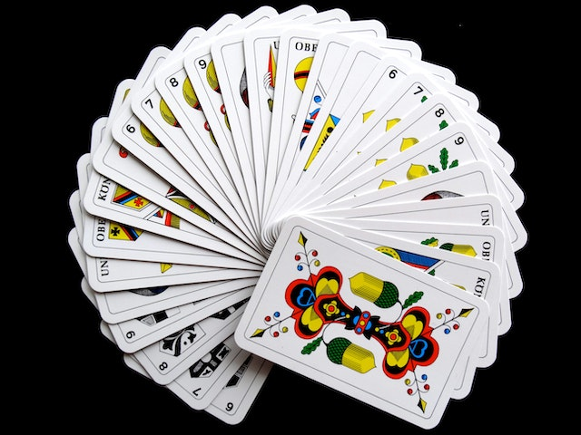

<br>

{fig-alt="Pick a Card" fig-align="center" width="286"}

##  Setting up R packages

```{r}
#| label: setup
#| code-fold: true
#| warning: false
#| message: false

library(tidyverse)
library(mosaic)

```


```{r}
#| label: Extra-Pedagogical-Packages
#| echo: false
#| message: false

library(checkdown)
library(epoxy)
library(TeachHist)
library(TeachingDemos)
library(visualize) # Plot Densities, Histograms and Probabilities as areas under the curve
library(grateful)
library(MKdescr)
library(downloadthis)
#devtools::install_github("mccarthy-m-g/embedr")
library(embedr) # Embed multimedia in HTML files
library(ggrepel)
library(marquee)

```

#### Plot Fonts and Theme

```{r}
#| label: plot-theme-ggplot4
#| cache: false
#| code-fold: true
#| messages: false
#| warning: false
#| 
library(systemfonts)
library(showtext)
## Clean the slate
systemfonts::clear_local_fonts()
systemfonts::clear_registry()
##
showtext_opts(dpi = 96) #set DPI for showtext
sysfonts::font_add(family = "Alegreya",
  regular = "../../../../../../fonts/Alegreya-Regular.ttf",
  bold = "../../../../../../fonts/Alegreya-Bold.ttf",
  italic = "../../../../../../fonts/Alegreya-Italic.ttf",
  bolditalic = "../../../../../../fonts/Alegreya-BoldItalic.ttf")

sysfonts::font_add(family = "Roboto Condensed", 
  regular = "../../../../../../fonts/RobotoCondensed-Regular.ttf",
  bold = "../../../../../../fonts/RobotoCondensed-Bold.ttf",
  italic = "../../../../../../fonts/RobotoCondensed-Italic.ttf",
  bolditalic = "../../../../../../fonts/RobotoCondensed-BoldItalic.ttf")
showtext_auto(enable = TRUE) #enable showtext
##
theme_custom <- function(){ 

    theme_bw(base_size = 10) + 
    
    # theme(panel.widths = unit(11, "cm"), 
    #       panel.heights = unit(6.79, "cm")) + # Golden Ratio
    
    theme(plot.margin = margin_auto(t = 1, r = 2, b = 1, l = 1, unit = "cm"),
          plot.background = element_rect(fill = "bisque",
                                         colour = "black",
                                         linewidth = 1)) + 
            
    theme_sub_axis(title = element_text(family = "Roboto Condensed", 
                                       size = 10),
                   text = element_text(family = "Roboto Condensed", 
                                       size = 8)) + 
    
    theme_sub_legend(text = element_text(family = "Roboto Condensed", 
                                         size = 6),
                     title = element_text(family = "Alegreya", 
                                          size = 8)) + 
    
    theme_sub_plot(title = element_text(family = "Alegreya", 
                                        size = 14, face = "bold"),
                   title.position = "plot",
                   subtitle = element_text(family = "Alegreya", 
                                           size = 10),
                   caption = element_text(family = "Alegreya", 
                                          size = 6),
                   caption.position = "plot") 
    
}

## Use available fonts in ggplot text geoms too!
ggplot2::update_geom_defaults(geom = "text", new = list(
  family = "Roboto Condensed",
  face = "plain",
  size = 3.5,
  color = "#2b2b2b"
)
)
ggplot2::update_geom_defaults(geom = "label", new = list(
  family = "Roboto Condensed",
  face = "plain",
  size = 3.5,
  color = "#2b2b2b"
)
)

ggplot2::update_geom_defaults(geom = "marquee", new = list(
  family = "Roboto Condensed",
  face = "plain",
  size = 3.5,
  color = "#2b2b2b"
)
)
ggplot2::update_geom_defaults(geom = "text_repel", new = list(
  family = "Roboto Condensed",
  face = "plain",
  size = 3.5,
  color = "#2b2b2b"
)
)
ggplot2::update_geom_defaults(geom = "label_repel", new = list(
  family = "Roboto Condensed",
  face = "plain",
  size = 3.5,
  color = "#2b2b2b"
)
)

## Set the theme
ggplot2::theme_set(new = theme_custom())

## tinytable options
options("tinytable_tt_digits" = 2)
options("tinytable_format_num_fmt" = "significant_cell")
options(tinytable_html_mathjax = TRUE)


## Set defaults for flextable
flextable::set_flextable_defaults(font.family = "Roboto Condensed")

```


## Introduction: The Lady who Drank Tea

> There is a famous story about a lady who claimed that tea with milk
> tasted different depending on whether the milk was added to the tea or
> the tea added to the milk. The story is famous because of the setting
> in which she made this claim. She was attending a party in Cambridge,
> England, in the 1920s. Also in attendance were a number of university
> dons and their wives. The scientists in attendance scoffed at the
> woman and her claim. What, after all, could be the difference?
>
> All the scientists but one, that is. Rather than simply dismiss the
> woman's claim, he proposed that they decide how one should test the
> claim. The tenor of the conversation changed at this suggestion, and
> the scientists began to discuss how the claim should be tested. Within
> a few minutes cups of tea with milk had been prepared and presented to
> the woman for tasting.
>
> At this point, you may be wondering who the innovative scientist was
> and what the results of the experiment were. The scientist was R. A.
> Fisher, who first described this situation as a pedagogical example in
> his 1925 book on statistical methodology\[\^1\]. Fisher developed
> statistical methods that are among the most important and widely used
> methods to this day, and most of his applications were biological.

### Game

Let's try an experiment. I'll flip 10 coins. You guess which are heads
and which are tails, and we'll see how you do. Please write down a
sequence of "H" or "T". Comparing with your classmates, we will
undoubtedly see that some of you did better and others worse.

What would be your impression of one of you got 9 guesses correct? Is
that SKILL or is that something else? What would be your **immediate
reaction** and **next move**?

### Analysis

Back to the Lady who drank Tea !!

> Let's suppose we decide to test the lady with ten cups of tea. We'll
> flip a coin to decide which way to prepare the cups. If we flip a
> head, we will pour the milk in first; if tails, we put the tea in
> first. Then we present the ten cups to the lady and have her state
> which ones she thinks were prepared each way.
>
> It is easy to give her a score (9 out of 10, or 7 out of 10, or
> whatever it happens to be). It is trickier to figure out what to do
> with her score. Even if she is just guessing and has no idea, she
> could get lucky and get quite a few correct -- maybe even all 10. But
> how likely is that?
>
> Now let's suppose the lady gets 9 out of 10 correct. That's not
> perfect, but it is better than we would expect for someone who was
> just guessing. On the other hand, it is not impossible to get 9 out of
> 10 just by guessing.
>
> So here is Fisher's great idea: **Let's figure out how hard it is to
> get 9 out of 10 by guessing**. If it's not so hard to do, then perhaps
> that's just what happened ( that she was guessing ), so we won't be
> too impressed with the lady's tea tasting ability. On the other hand,
> if it is really unusual to get 9 out of 10 correct by guessing, then
> we will have some evidence that she must be able to tell something (
> and has an unusual Skill).

Here is Fisher's set up with cups of tea, and the lady's guesses:

```{r}
#| code-fold: true
set.seed(1947)
lady_tasting_tea <- tibble(cup = 1:10, first = shuffle(rep(x = c("tea", "milk"), 5)), guess = first, correct = TRUE)

lady_tasting_tea
```


> But how do we figure out how unusual it is to get 9 out of 10 just by
> guessing? Let's just flip a bunch of coins and keep track. If **we believe** the lady
> is just guessing, she might as well be flipping a coin.
>
> So here's the plan. We'll flip 10 coins, and repeat that experiment
> 10000 times. We'll call the heads correct guesses and the tails
> incorrect guesses.

```{r}
#| label: fig-all-10-heads
#| fig-cap: "Modelling Cups of Tea with Coin Flips"
#| code-fold: true
#| out-width: "75%"
#| out-height: "50%"
#| fig-align: "center"
#| 

set.seed(1234)
random_ladies <- mosaic::do(10000) * mosaic::rflip(10)
mosaic::tally(~ heads, data = random_ladies)

theme_set(new = theme_custom())
gf_histogram(~ heads, data = random_ladies,
             binwidth = 1, origin = -0.5, # centering the bars
             fill = ~ heads>=10, 
             colour = "black", linewidth = 0.2) %>%

  gf_refine(scale_x_continuous(breaks = c(1:10)),
            scale_fill_brewer(palette = "Set1")) %>%
  gf_labs(title = "10 Coin Flips, 10000 times",
          subtitle = "Can we get all 10 Heads?")

```

So what do we conclude? It is possible that the lady could get 9 or 10
correct just by guessing, but it is not very likely (it only happened in
about $\frac{97+8}{10000} = 1.05\%$ of our simulations). So one of two
things must be true:

• The lady got unusually "lucky", by chance; OR\
• The lady is not just guessing and really has some ability in this
regard.

## Commentary

- First we realize something is **surprising**, and then we have a
**question** or **doubt**. This is based on something we see, or
measure, a **test statistic**. In our story, it is the **score** of
$10/10$ that the Lady was able to achieve about how the Tea was made.

- We then **assume** the Lady is guessing *and* somehow **by chance** able
to guess correctly. This would be our....**NULL Hypothesis**. This is
our (conservative) *belief* about the **Real World**.

- We then *randomly generate* many **Parallel Counterfactual Worlds**,
where we repeat the experiment many many times, each time calculating
the *test statistic*, under the *assumption* of the NULL Hypothesis is
TRUE.

- We see how often our *Parallel Worlds* can mimic or exceed *Real World*
measurement of the the *test statistic* by comparison. If this is common
(i.e. probability is high) we say we cannot reject the NULL Hypothesis
(and the Lady is lucky). If the occurrence is rare, as in our case, we
say we have reason to reject the NULL Hypothesis and reason to believe
an underlying pattern (and Lady's ability is beyond **Question** !)

This is the essence of the **Simulation Method** in statistical
modelling. Take one more look at the picture from [Allen Downey's blog](https://allendowney.blogspot.com/2016/06/there-is-still-only-one-test.html), below:

{#fig-simulation-test fig-align="center" width=60%}

From Reference #1:

> Hypothesis testing can be thought of as a 4-step process:
>
> 1.  State the null and alternative hypotheses.
>
> 2.  Compute a test statistic.
>
> 3.  Determine the p-value.
>
> 4.  Draw a conclusion.
>
>     In a traditional introductory statistics course, once this general
>     framework has been mastered, the main work is in **applying the
>     correct formula** to compute the standard test statistics in step
>     2 and using a table or computer to **determine the p-value** based
>     on the known (usually approximate) **theoretical distribution of
>     the test statistic** under the null hypothesis.
>
>     In a **simulation-based approach**, steps 2 and 3 change. In Step
>     2, it is no longer required that the test statistic be normalized
>     to conform with a known, named distribution. Instead, natural test
>     statistics, like the difference between two sample means $y1 − y2$
>     can be used.
>
>     In Step 3, we use **randomization to approximate the sampling
>     distribution of the test statistic**. Our lady tasting tea example
>     demonstrates how this can be done from first principles. More
>     typically, we will use randomization **to create new simulated
>     data sets** ( "*Parallel Worlds*") that are like our original data
>     in some ways, but make the null hypothesis true. For each
>     simulated data set, we calculate our test statistic, just as we
>     did for the original sample. Together, this collection of test
>     statistics computed from the simulated samples constitute our
>     randomization distribution.
>
>     When creating a randomization distribution, we will attempt to
>     satisfy 3 guiding principles.
>
> 5.  Be consistent with the null hypothesis. We need to **simulate a
>     world** in which the null hypothesis is true. If we don't do this,
>     we won't be testing our null hypothesis.
>
> 6.  Use the data in the **original sample**. The original data should
>     shed light on some aspects of the distribution that are not
>     determined by null hypothesis. For example, a null hypothesis
>     about a mean doesn't tell us about the shape of the population
>     distribution, but the data give us some indication.
>
> 7.  Reflect the way the original data were collected.

From Chihara and Hesterberg:

> This is the core idea of statistical significance or classical
> hypothesis testing -- to calculate how often pure random chance would
> give an effect as large as that observed in the data, in the absence
> of any real effect. If that probability is small enough, we conclude
> that the data provide convincing evidence of a real effect.

## An Idea to Encourage You: Stats Lessons from `Sholay`!!

<center>

</center>

<br>

|Gabbar Singh  | Stats Teacher|
|------------- | -------------|
|Kitne Aadmi thay? | How many observations do you have? n < 30 is a joke.
|Kya Samajh kar aaye thay? Gabbar khus hoga? Sabaasi dega kya?  | What are the levels in your Factors? Are they binary? Don't do ANOVA just yet!
|(Fires off three rounds ) Haan, ab theek hai! | Yes, now the dataset is balanced wrt the factor (Treatment and Control).
|Is pistol mein teen zindagi aur teen maut bandh hai. Dekhte hain kisko kya milega. | This is our Research Question, for which we will Design an Experiment.
|(Twirls the chambers of his revolver)  Hume kuchh nahi pataa! |Let us perform a non-parametric Permutation Test for this Factor!
|Kamaal ho gaya! | Fantastic! Our p-value is so small that we can reject the NULL Hypothesis!!

: Gabbar conducts a Permutation Test

Go and like this post at: <https://www.linkedin.com/pulse/stat-lessons-from-sholay-arvind-venkatadri-wgtrf/?trackingId=c0b4UCTLRea6U%2Bj%2Bm4TCtw%3D%3D>


## References

1.  Mine Çetinkaya-Rundel and Johanna Hardin. [Chapter 11, Hypothesis Testing with Randomization](https://openintro-ims.netlify.app/foundations-randomization.html#chp11-review) in [Introduction to Modern Statistics (1st
    Ed)](https://openintro-ims.netlify.app/index.html) 
1.  [Allen Downey, There is still only one
    test](https://allendowney.blogspot.com/2016/06/there-is-still-only-one-test.html)
1. Tim Hesterberg.(2014). *What Teachers Should Know about the Bootstrap: Resampling in the Undergraduate Statistics Curriculum*. <https://arxiv.org/abs/1411.5279>
1.  Daniel Kaplan, Nicholas J. Horton, and Randall Pruim,
    *Simulation-based inference with mosaic*
    <https://www.mosaic-web.org/mosaic/articles/Resampling.html>
1.  R.A. Fisher. *Statistical Methods for Research Workers*. Oliver &
    Boyd, 1925
1.  Times of India. [*Virat Kohli and his Strange Luck with the Coin Toss*](https://timesofindia.indiatimes.com/sports/cricket/icc-mens-t20-world-cup/in-numbers-virat-kohli-and-his-strange-luck-with-the-coin-toss/articleshow/87538443.cms)
1.  Laura Chihara, Tim Hesterberg.(2019) *Mathematical Statistics with
    Resampling and R*, Wiley.
1.  D. Salsburg. *The Lady Tasting Tea: How statistics revolutionized
    science in the twentieth century.* W.H. Freeman, New York, 2001


